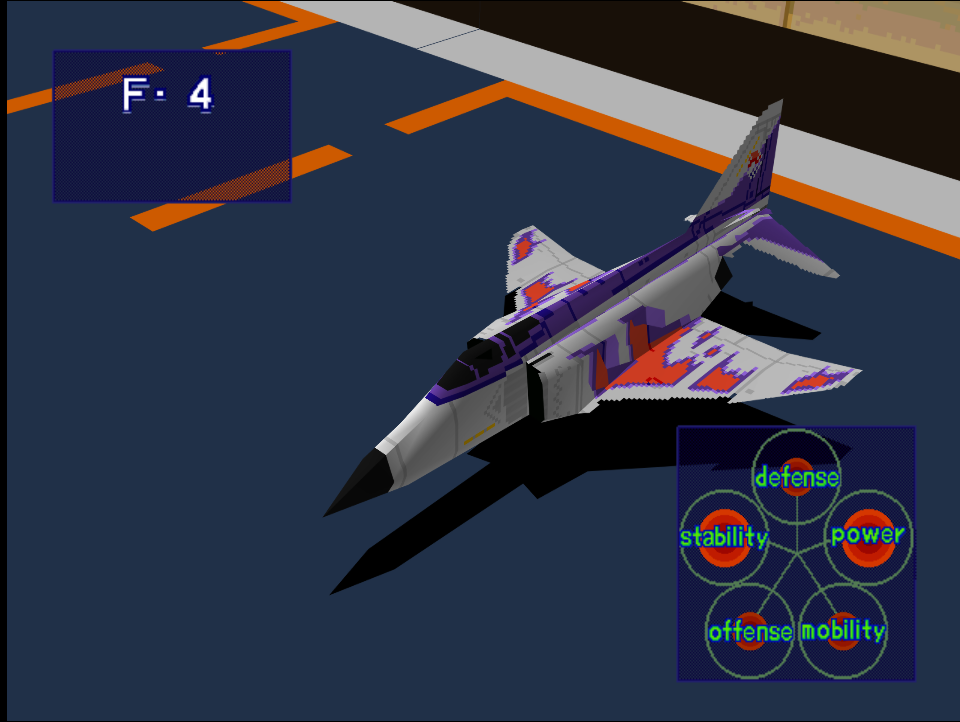
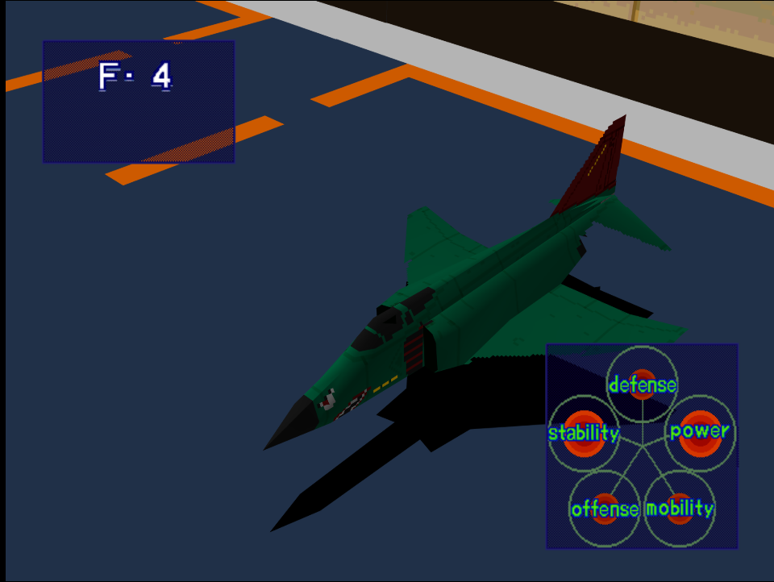

|Original Color|Alternate Color|
|-|-|
|

|

|

# Price
- 1,500,000

# Availability
- Available from the start
- Easy/Normal: Additional aircraft unlocked after completing [Night Attack on a Coastal City](/missions/m04-night-attack-on-a-coastal-city)

# Remark

A starter aircraft with below average overall performance. On Easy or Normal difficulty it's already effectively rendered obsolete due to presence of better starter aircraft.

# Encounter Locations

|Mission Name|Type|Quantity|
|-|-|-|
|[Destroy Enemy Supply Lines!](/missions/m01-destroy-enemy-supply-lines)|Enemy|1 (Easy/Normal) 2 (Hard)|
|[Night Attack on a Coastal City!](/missions/m04-night-attack-on-a-coastal-city)|Enemy|2|
|[Storm the Mother Ship!](/missions/m12-storm-the-mother-ship)|Enemy|2|

# Wingman

|Name|Rank|Wage|
|-|-|-|
|William|Rookie|1,000,000|