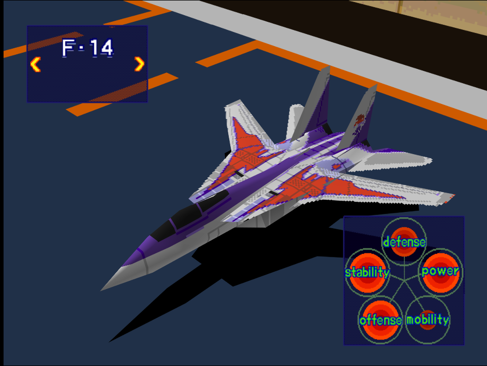
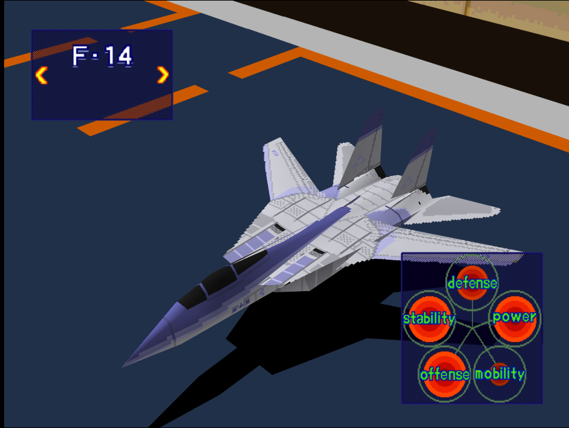

|Original Color|Alternate Color|
|-|-|
|

|

|

# Price
- 6,000,000
  
# Availability

- Easy/Normal: Available from the start
- Hard: Complete [Fighter Superiority!](/missions/m02-fighter-superiority!)

# Remark

Sluggish, but packs a lot of punch for a starter aircraft on lower difficulty, the F-14 is the mainstay pick for most air-to-air and interception missions.

# Encounter Locations

|Mission Name|Type|Quantity|
|-|-|-|
|[Destroy Pipe-Lines!](/missions/m05-destroy-pipe-lines)|Enemy|2|
|[VIP Recovery Mission!](/missions/m10-vip-recovery-mission)|Enemy|2|
|[Storm the Mother Ship!](/missions/m12-storm-the-mother-ship)|Enemy|3|
|[Take a Fortress!](/missions/m15-take-a-fortress)|Enemy|2 (Easy/Normal) 4 (Hard)|

# Wingman

|Name|Rank|Wage|
|-|-|-|
|Sergeo|Rookie|3,000,000|