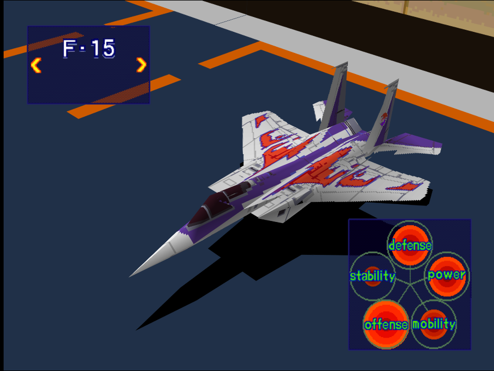
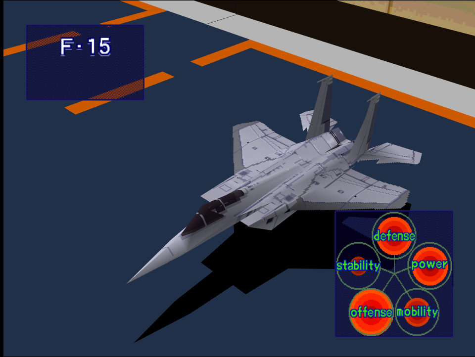

|Original Color|Alternate Color|
|-|-|
|

|

|

# Price
- 4,000,000 Credits

# Availability
- Easy/Normal: Complete [Intercept!](/missions/m03-intercept)
- Hard: Complete [Night Attack on a Coastal City!](/missions/m04-night-attack-on-a-coastal-city)

# Remark

Heavy fighter with exceptional attack power and survivability. One of the early game aircraft that performs well until endgame.

# Encounter Locations

|Mission Name|Type|Quantity|
|-|-|-|
|[Night Attack on a Coastal City!](/missions/m04-night-attack-on-a-coastal-city)|Enemy|1 (Easy/Normal) 2 (Hard)|
|[Destroy Pipe-Lines!](/missions/m05-destroy-pipe-lines)|Enemy|2|
|[VIP Recovery Mission!](/missions/m10-vip-recovery-mission)|Target|2 (Easy/Normal) 4 (Hard)|
|[Reconnaisance](/missions/m13-reconnaisance)|Target|3|

# Wingman

|Name|Rank|Wage|
|-|-|-|
|Joe|Veteran|7,000,000|