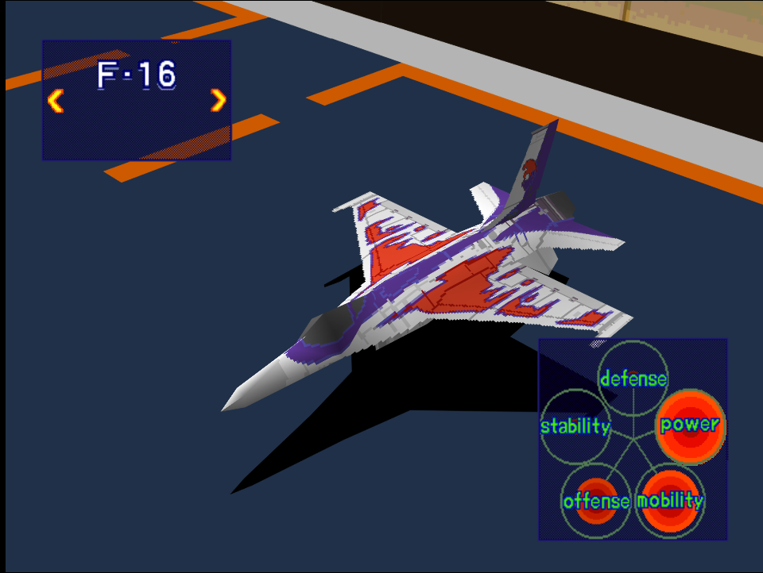
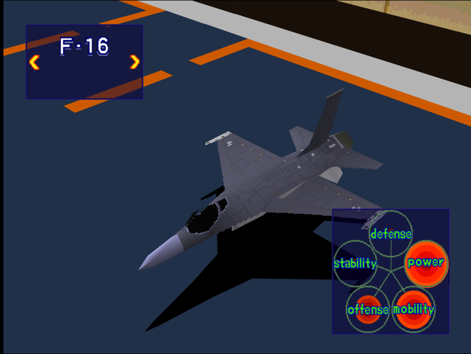

|Original Color|Alternate Color|
|-|-|
|

|

|

# Price
- 2,500,000

# Availability
- Easy: Complete [Destroy Pipe-Lines!](/missions/m05-destroy-pipe-lines) or [Destory Production Site](/missions/m06-destroy-production-site)
- Normal: Unlocked after completing [Destroy Enemy Staging Zone](/missions/m08-destroy-enemy-staging-zone)

# Remark

Fast and maneuverable light fighter with decent firepower. Poor stability and durability makes avoiding SAM and AA Guns mandatory for survival.

# Encounter Locations

|Mission Name|Type|Quantity|
|-|-|-|
|[Destroy Production Sites](/missions/m06-destroy-production-site)|Enemy|2|

# Wingman

|Name|Rank|Wage|
|-|-|-|
|Bill|Veteran|8,000,000|