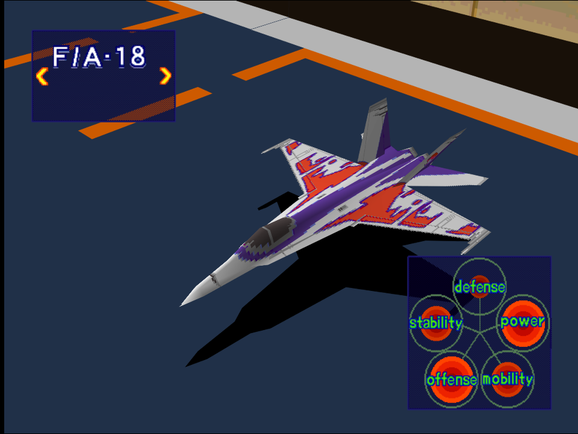
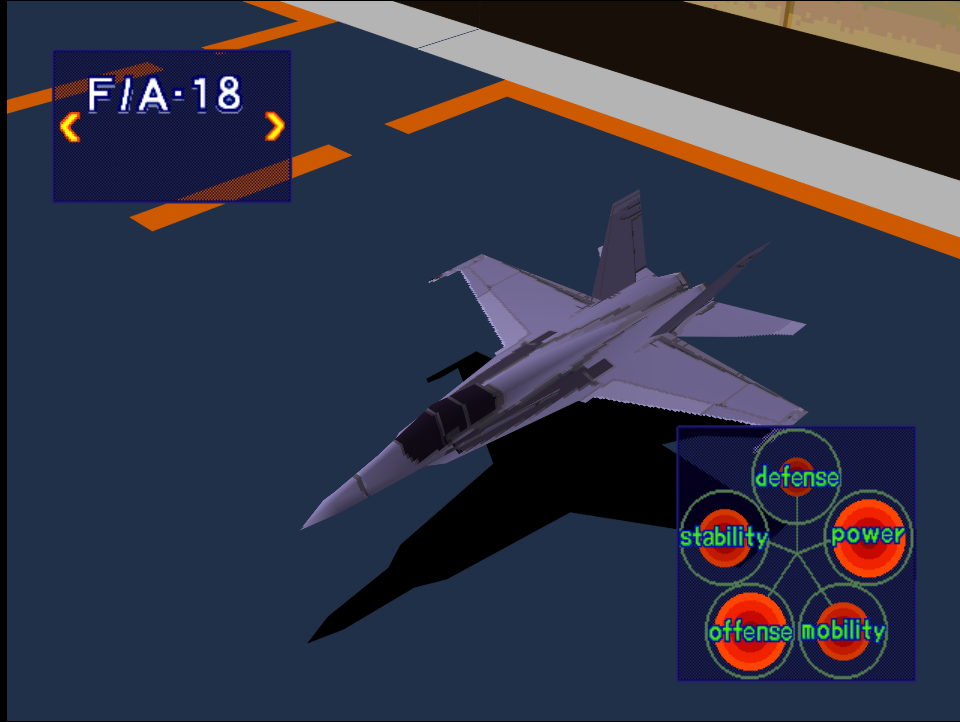

|Original Color|Alternate Color|
|-|-|
|

|

|

# Price
- 3,000,000

# Availability
- Easy: Available from the start
- Normal/Hard: Complete [Fighter Superiority!](/missions/m02-fighter-superiority)

# Remark

Well balanced early game fighter with decent maneuverability. Somewhat struggles to survive air to ground missions due to below average defense.

# Encounter Locations

|Mission Name|Type|Quantity|
|-|-|-|
|[Intercept!](/missions/m03-intercept)|Enemy|2 (Easy/Normal)   4 (Hard)|
|[Take a Fortress!](/missions/m03-intercept)|Enemy|2|

# Wingman

|Name|Rank|Wage|
|-|-|-|
|Riho|Veteran|5,000,000|