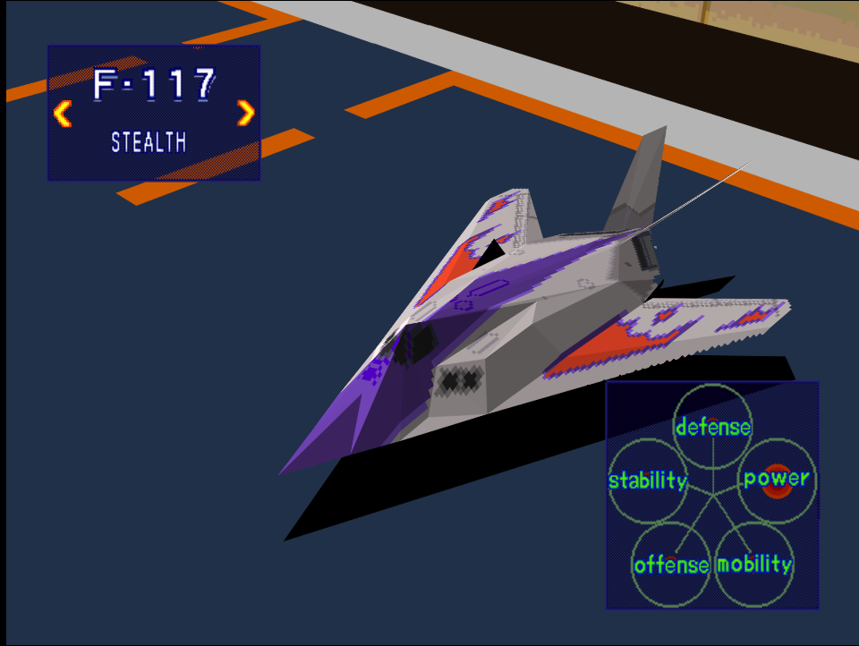
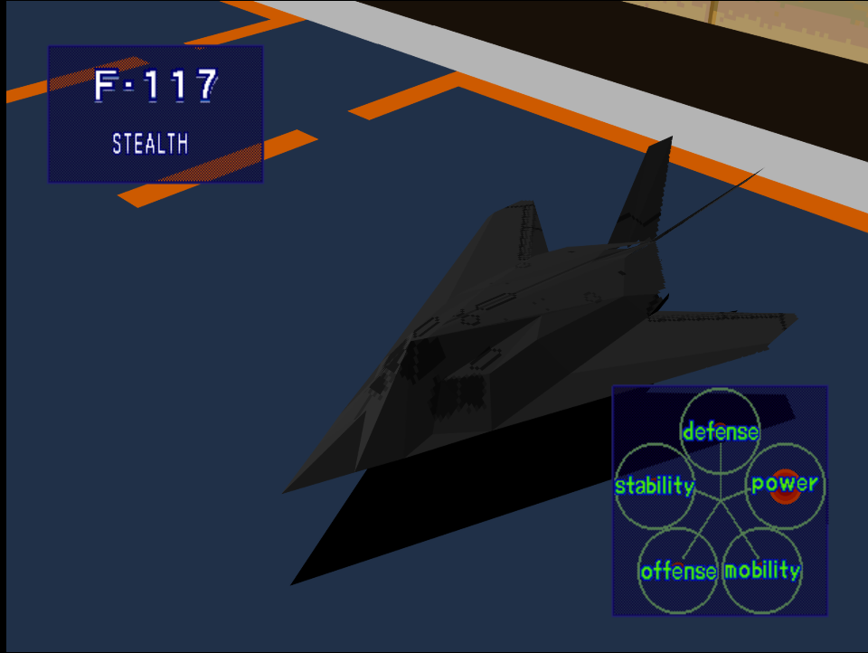

|Original Color|Alternate Color|
|-|-|
|

|

|

# Price
- 4,000,000

# Availability
- Complete [Destroy Enemy Supply Lines!](/missions/m01-destroy-enemy-supply-lines)

# Remark

Early game stealth fighter with abysmal stats. The stealth gimmick may be rather useful on Easy or Normal difficulty but on Hard it serves almost no use since its poor defense only means anything can blow it out of the sky almost immediately.

# Encounter Locations

|Mission Name|Type|Quantity|
|-|-|-|
|[Destroy Production Sites](/missions/m06-destroy-production-site)|Enemy|2|

# Wingman

|Name|Rank|Wage|
|-|-|-|
|Baron|Veteran|1,000,000|