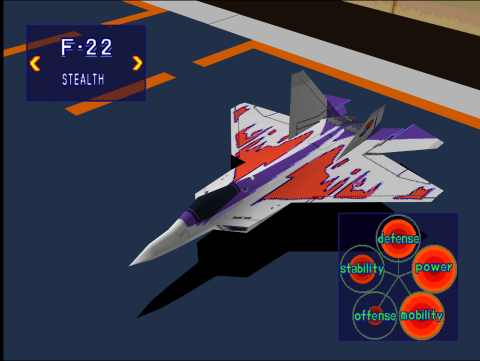
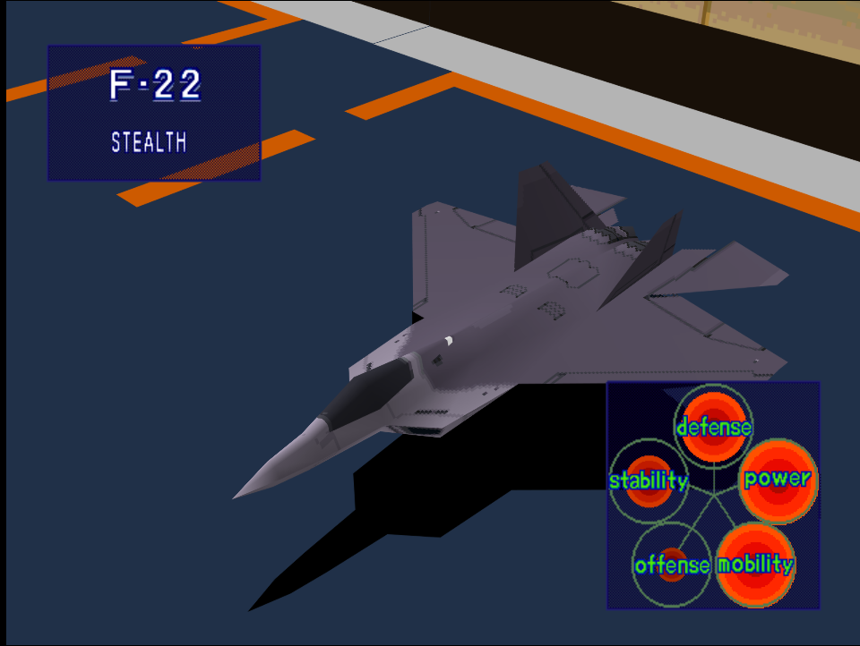

|Original Color|Alternate Color|
|-|-|
|

|

|

# Price
- 9,000,000

# Availability.
- Easy/Normal: Complete [Take a Fortress!](/missions/m15-take-a-fortress)
- Hard: Complete [Destroy Refueling Center!](/missions/m14-destroy-refueling-center)

# Remark
The ultimate stealth fighter with near perfect flight performance and decent survivability for a stealth fighter. Low offense stats is the only what balances it out from being the true superfighter.

# Encounter Locations

|Mission Name|Type|Quantity|
|-|-|-|
|[Take a Fortress!](/missions/m15-take-a-fortress)|Enemy|2|
|[Discovery of Airborne Fortress!](/missions/m17-discovery-of-airborne-fortress)|Enemy|1 (Respawns indefinitely)|

# Wingman

|Name|Rank|Wage|
|-|-|-|
|Hal|Ace|15,000,000|