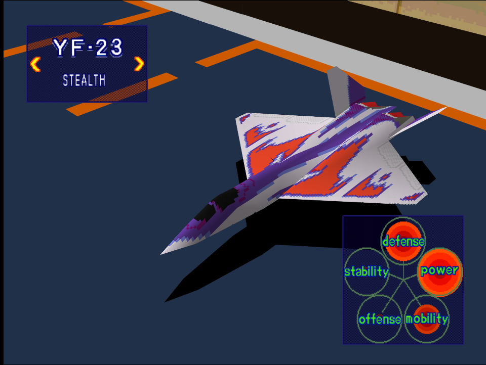
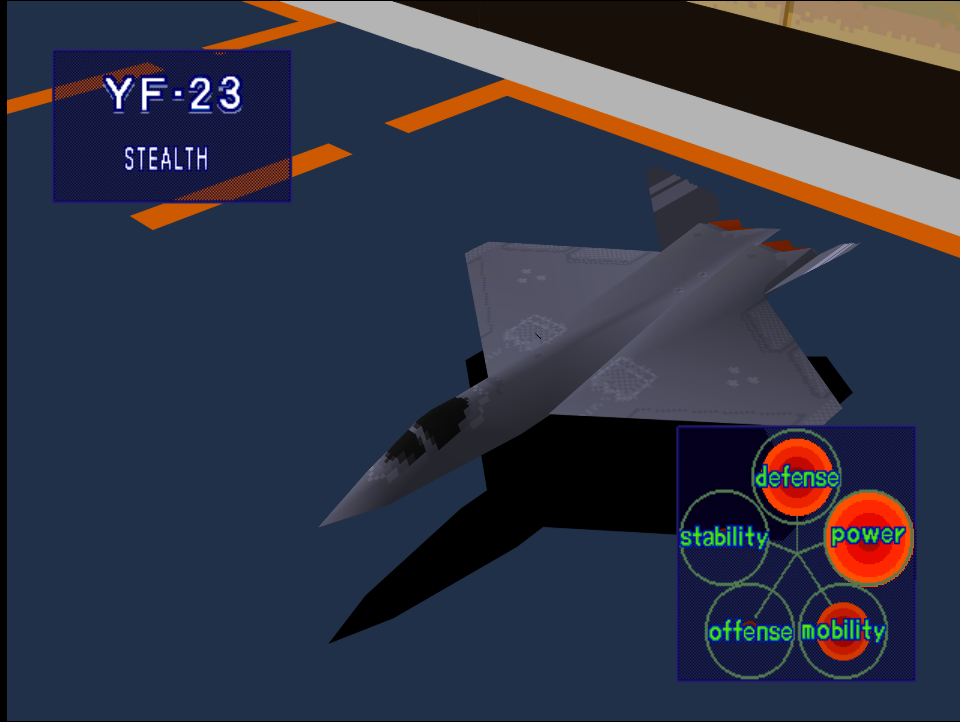

|Original Color|Alternate Color|
|-|-|
|

|

|

# Price
- 9,000,000 Credits

# Availability
- Easy:  Complete [Destroy Pipe-Lines!](/missions/m05-destroy-pipe-lines) or [Destroy Production Site](/missions/m06-destroy-production-site)
- Normal: Complete [Destroy Military Port Facilities!](/missions/m09-destroy-military-port-facilities)
- Hard: Complete [Repel Enemy from Captured Port](/missions/m11-repel-enemy-from-captured-port)

# Remark
The second unlockable stealth fighter which represents a major step up from the pitiful F-117. Flies nicely, but has poor offense stats which limits its usefulness at taking down tougher targets especially bombers and other large aircraft.

# Encounter Locations

|Mission Name|Type|Quantity|
|-|-|-|
|[Destroy Enemy Staging Zone!](/missions/m08-destroy-enemy-staging-zone)|Enemy|3|
|[Reconnaissance](/missions/m13-reconnaissance)|Enemy|2|
|[Destroy Refueling Center!](/missions/m14-destroy-refueling-center)|Enemy|2|

# Wingman

|Name|Rank|Wage|
|-|-|-|
|Martin|Ace|10,000,000|