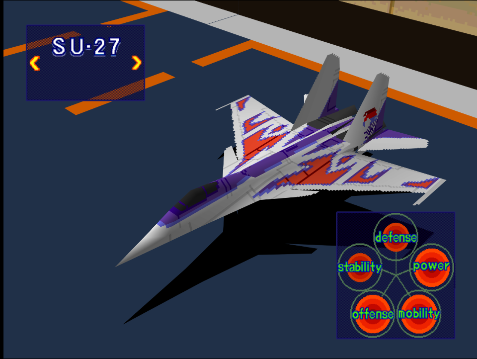
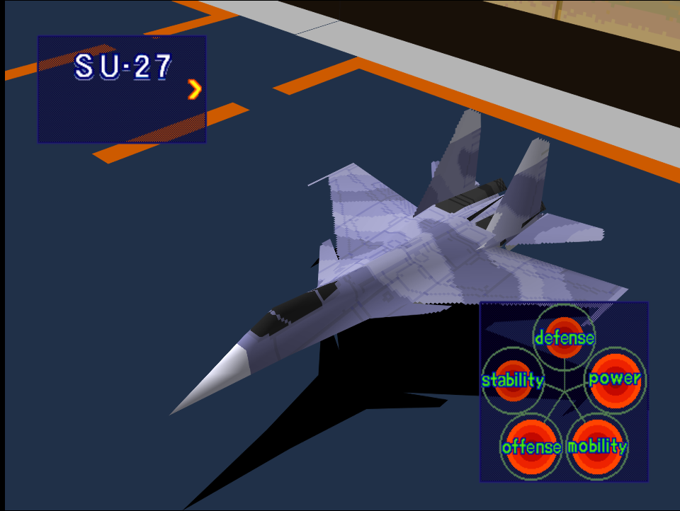

|Original Color|Alternate Color|
|-|-|
|

|

|

# Price
- 4,000,000

# Availability
- Easy:  Complete [Destroy Pipe-Lines!](/missions/m05-destroy-pipe-lines) or [Repel Enemy from Captured Port](/missions/m11-repel-enemy-from-captured-port)
- Normal: Complete [VIP Recovery Mission](/missions/m10-vip-recovery-mission) or [Repel Enemy from Captured Port](/missions/m11-repel-enemy-from-captured-port) 
- Hard: Complete [Storm the Mother Ship](/missions/m12-storm-the-mother-ship)

# Remark
High-end fighter with excellent overall stats and superb maneuverability, the Su-27 serves as decent non-stealth alternative to the F-22.

# Encounter Locations

|Mission Name|Type|Quantity|
|-|-|-|
|[Destory Production Site](/missions/m06-destroy-production-site)|Enemy|2|
|[Destroy Refueling Center!](/missions/m14-destroy-refueling-center)|Enemy|2|

# Wingman

|Name|Rank|Wage|
|-|-|-|
|Yang|Ace|11,000,000|