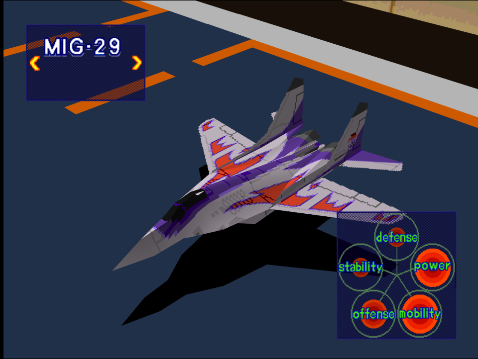
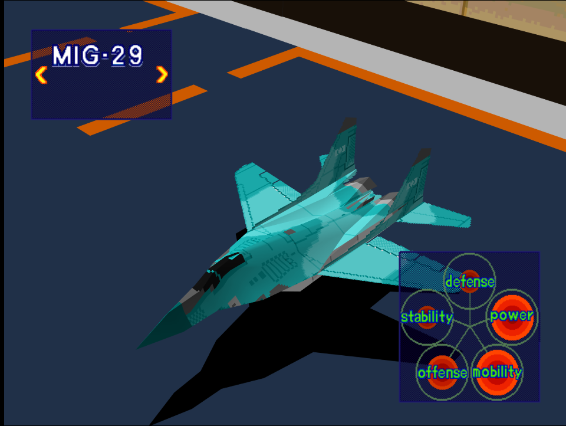

|Original Color|Alternate Color|
|-|-|
|

|

|

# Price
- 2,500,000

# Availability
- Easy:  Available from the start
- Normal: Complete [Destroy Production Sites](/missions/m06-destroy-production-site) 
- Hard: Complete [Destroy Pipe-Lines!](/missions/m05-destroy-pipe-lines)

# Remark
An early game alternative to the F/A-18 that trades slight firepower for better maneuverability while still shares the same drawback of having poor defense.

# Encounter Locations

|Mission Name|Type|Quantity|
|-|-|-|
|[Destroy Enemy Staging Zone!](/missions/m08-destroy-enemy-staging-zone)|Enemy|2|
|[Destroy Military Port Facilities!](/missions/m09-destroy-enemy-port-facilities)|Enemy|2|

# Wingman

|Name|Rank|Wage|
|-|-|-|
|Timothy|Veteran|5,000,000|