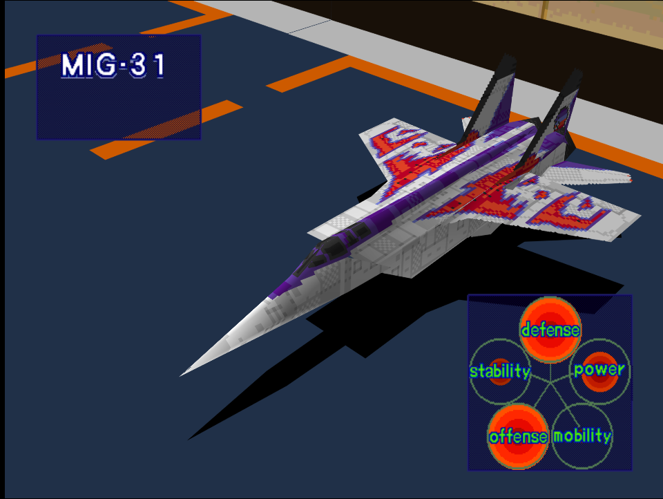
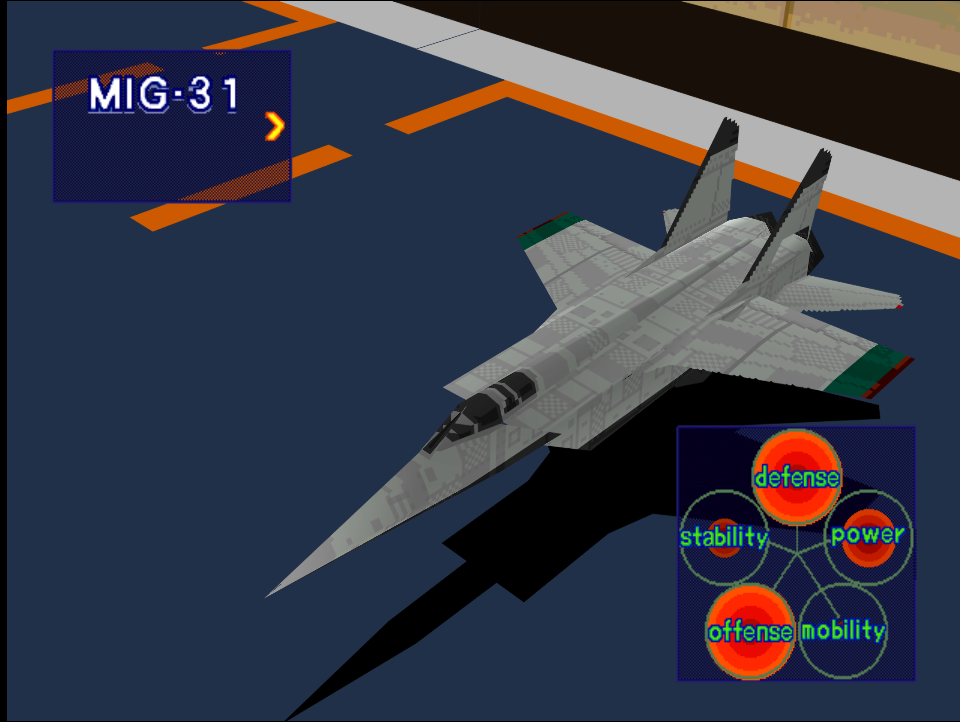

|Original Color|Alternate Color|
|-|-|
|

|

|

# Price
- 6,000,000

# Availability
- Easy: Available to purchase from the start
- Normal/Hard: Complete [Destroy Enemy Supply Lines!](/missions/m01-destroy-enemy-supply-lines)

# Remark
An alternative early game interceptor to the F-14 with maxed out defense and offense stats, at cost of even worse maneuverability. Useful for bomber intercept missions but not much for anything else.

# Encounter Locations

|Mission Name|Type|Quantity|
|-|-|-|
|[Destroy Enemy Supply Lines!](/missions/m01-destroy-enemy-supply-lines)|Enemy|1 (Easy/Normal) 2 (Hard)|
|[Night Attack on a Coastal City!](/missions/m04-night-attack-on-a-coastal-city)|Enemy|2|
|[Repel Enemy from Captured Port](/missions/m11-repel-enemy-from-captured-port)|Enemy|2|

# Wingman

|Name|Rank|Wage|
|-|-|-|
|Yully|Veteran|3,000,000|