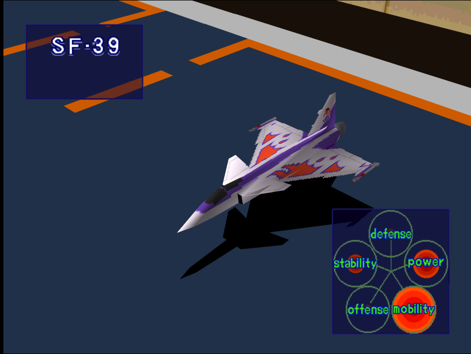
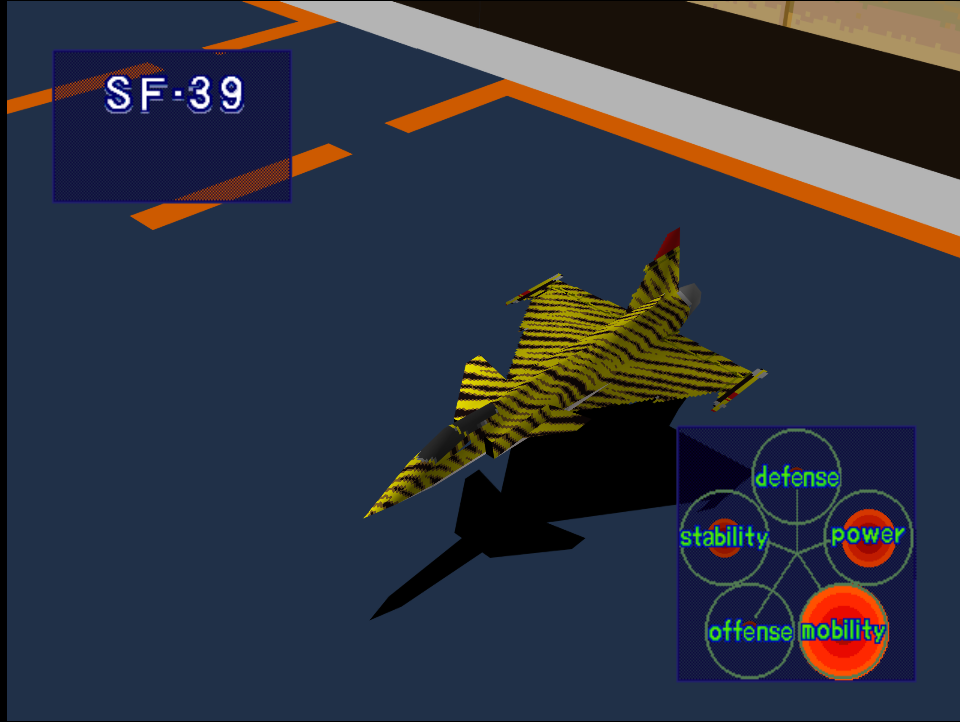

|Original Color|Alternate Color|
|-|-|
|

|

|

# Price
- 5,000,000

# Availability
- Easy: Complete [Destroy Military Port Facilities](/missions/m09-destroy-military-port-facilities) or [Storm the Mother Ship](/missions/m12-storm-the-mother-ship)
- Normal: Complete [Storm the Mother Ship](/missions/m12-storm-the-mother-ship) or [Reconnaissance](/missions/m13-reconnaissance)
- Hard: Complete [Reconnaissance](/missions/m13-reconnaissance)

# Remark
Light fighter with outstanding maneuverability, but nothing else to offer. While it can outturn almost everything, it also struggles at prolonged air-to-air combat due to its poor offense stats.

# Encounter Locations

|Mission Name|Type|Quantity|
|-|-|-|
|[Take a Fortress!](/missions/m15-take-a-fortress)|Enemy|2|

# Wingman

|Name|Rank|Wage|
|-|-|-|
|Fritz|Ace|13,000,000|