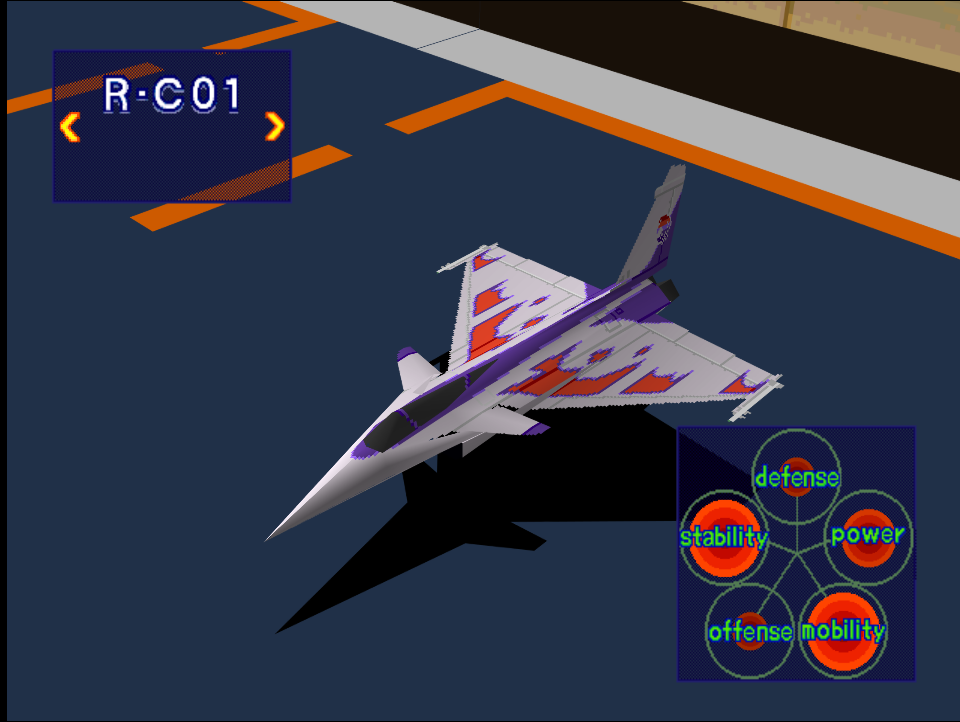
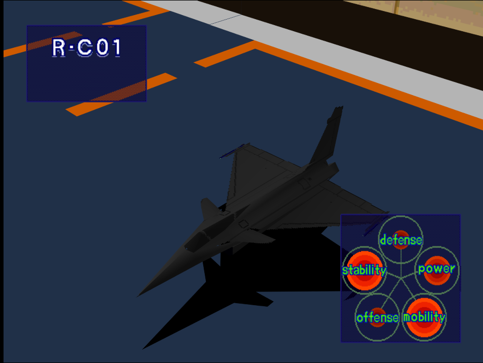

|Original Color|Alternate Color|
|-|-|
|

|

|

# Price
- 5,000,000 Credits

# Availability
- Easy: Complete [Destroy Military Port Facilities!](/missions/m09-destroy-military-port-facilities) or [Storm the Mother Ship!](/missions/m12-storm-the-mother-ship)
- Normal: Complete [Storm the Mother Ship!](/missions/m12-storm-the-mother-ship) or [Reconnaissance](/missions/m13-reconnaissance)
- Hard: Complete [VIP Recovery Mission!](/missions/m10-vip-recovery-mission)

# Remark
A more balanced Eurocanard offering compared to the SF-39, a decent all rounder for mid game until end game.

# Encounter Locations

|Mission Name|Type|Quantity|
|-|-|-|
|[Destroy Military Port Facilities!](/missions/m09-destroy-military-port-facilities)|Enemy|2|
|[Repel Enemy from Captured Port](/missions/m11-repel-enemy-from-captured-port)|Enemy|2|

# Wingman

|Name|Rank|Wage|
|-|-|-|
|Ana|Ace|10,000,000|