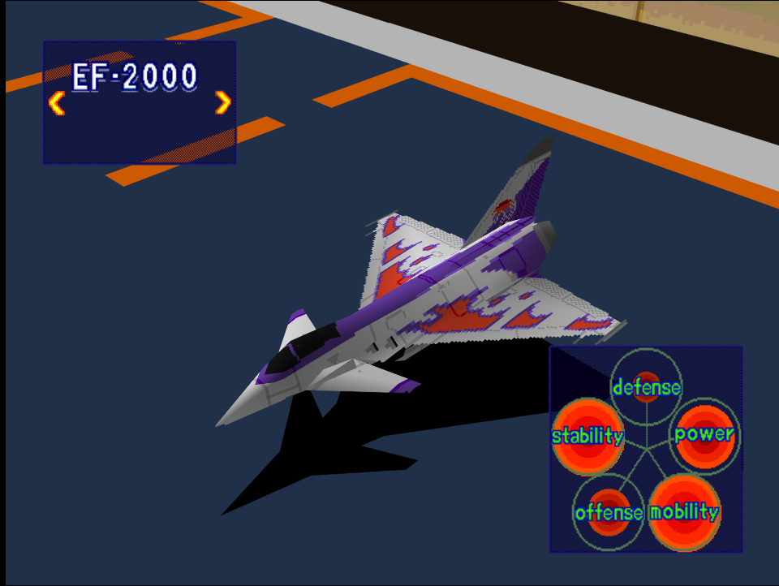
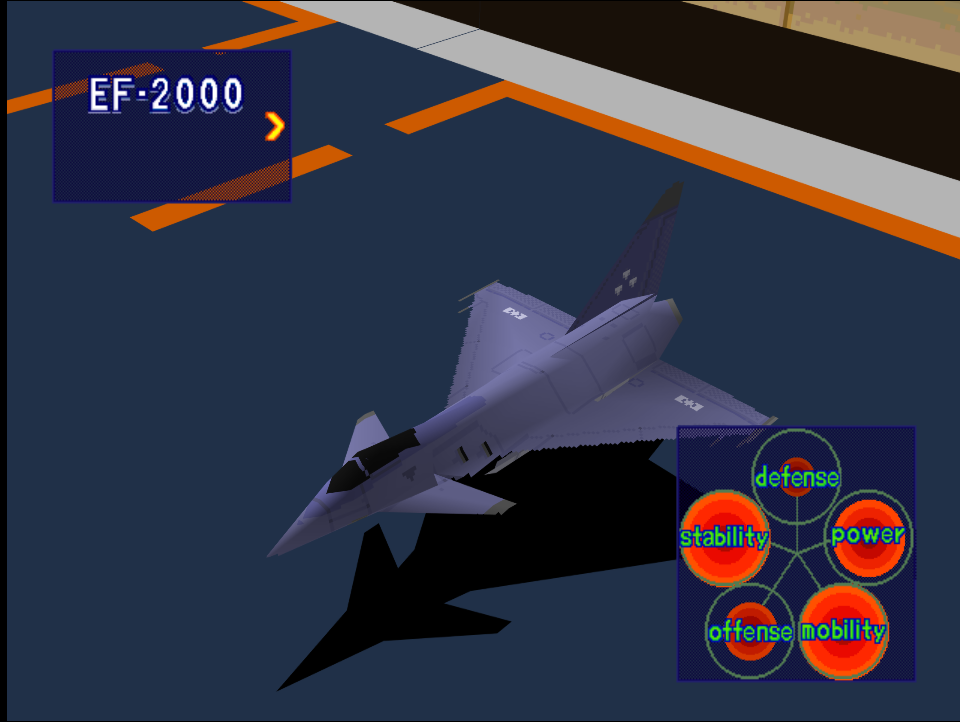

|Original Color|Alternate Color|
|-|-|
|

|

|

# Price
- 2,500,000 Credits

# Availability
- Easy: Complete [Destroy Military Port Facilities!](/missions/m09-destroy-military-port-facilities) or [Storm the Mother Ship!](/missions/m12-storm-the-mother-ship)
- Normal: Complete [Destroy Refueling Center!](/missions/m14-destroy-refueling-center))
- Hard: Complete [Take a Fortress!](/missions/m15-take-a-fortress)

# Remark
Cheaper alternative to the R-C01 with near identical stats, but has better engines.

# Encounter Locations

|Mission Name|Type|Quantity|
|-|-|-|
|[Storm the Mother Ship!](/missions/m12-storm-the-mother-ship)|Enemy|2|

# Wingman

|Name|Rank|Wage|
|-|-|-|
|Juliette|Veteran|9,000,000|