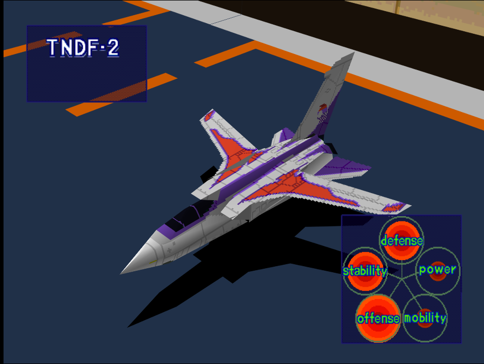
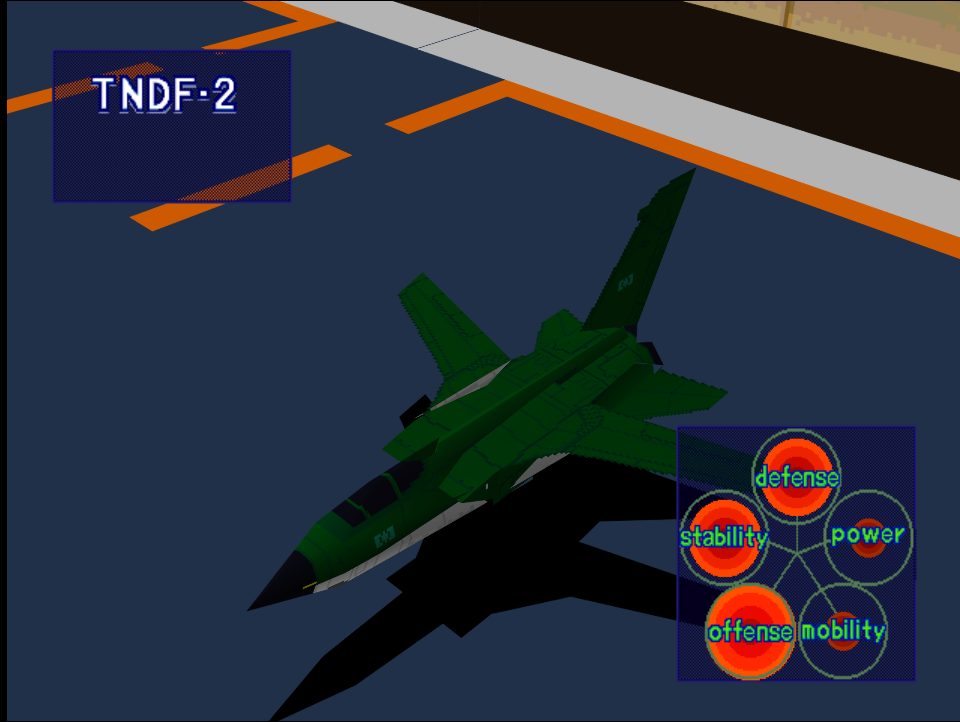

|Original Color|Alternate Color|
|-|-|
|

|

|

# Price
- 4,000,000 Credits

# Availability
- Easy: Complete [Fighter Superiority!](/missions/m02-fighter-superiority!)
- Normal/Hard: Complete [Intercept!](/missions/m03-intercept)

# Remark
An cheaper alternative to the F-14 and MiG-31, it boasts high offense and defense stats but inferior engine power than both fighters.

# Encounter Locations

|Mission Name|Type|Quantity|
|-|-|-|
|[Fighter Superiority!](/missions/m02-fighter-superiority!)|Enemy|2|
|[Intercept!](/missions/m03-intercept)|Target|2|
|[Night Attack on a Coastal City!](/missions/m04-night-attack-on-a-coastal-city)|Enemy|2|
|[Destroy Pipe-Lines!](/missions/m05-destroy-pipe-lines)|Enemy|2|

# Wingman

|Name|Rank|Wage|
|-|-|-|
|Philip|Rookie|2,000,000|