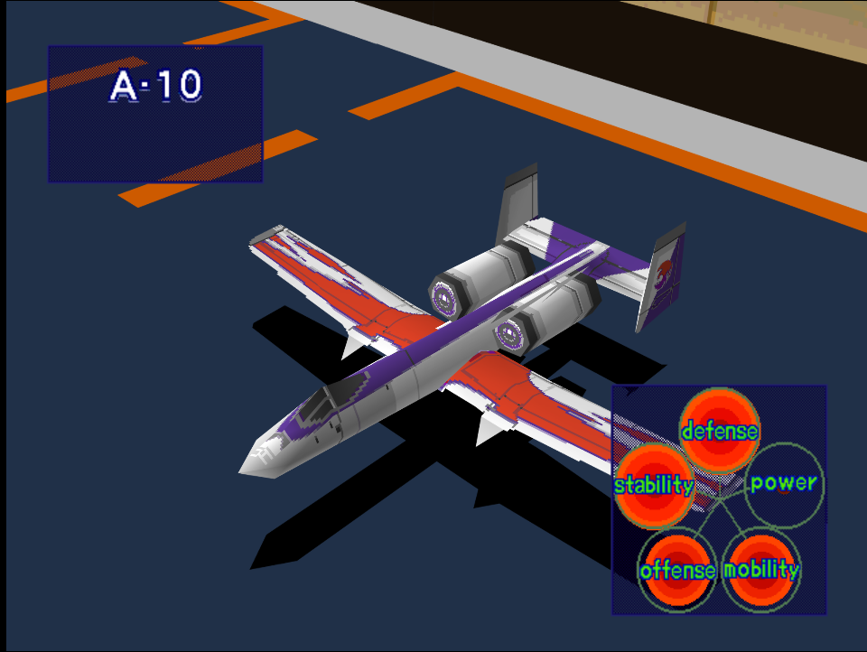
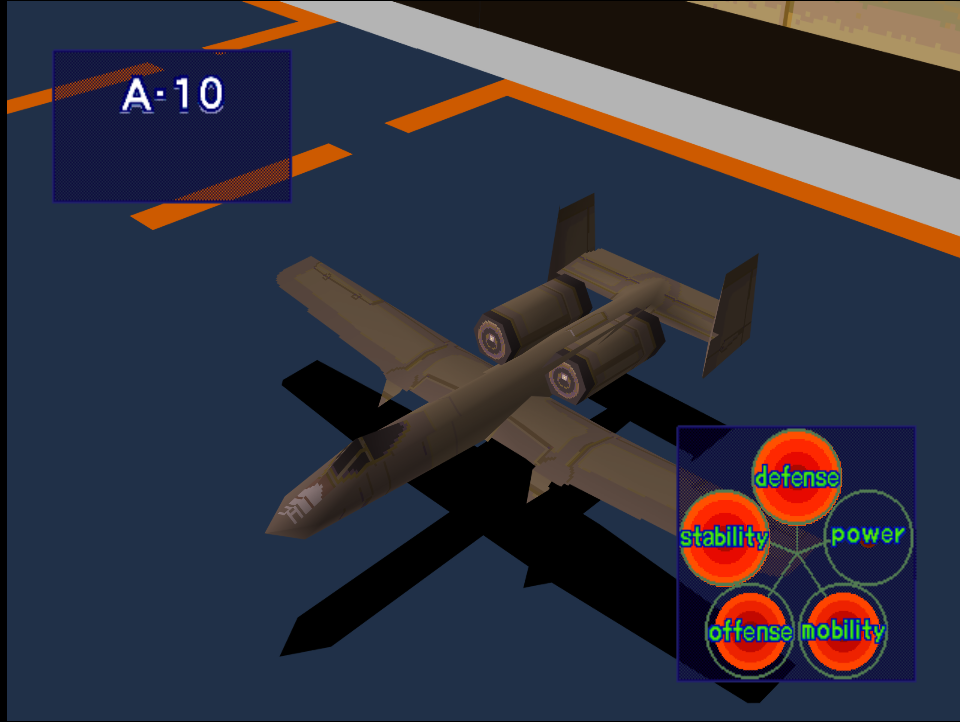

|Original Color|Alternate Color|
|-|-|
|

|

|

# Price
- 800,000

# Availability
- Easy: Complete [Night Attack on a Coastal City!](/missions/m04-night-attack-on-a-coastal-city)
- Normal: Complete [Destroy Pipe-Lines!](/missions/m05-destroy-pipe-lines)
- Hard: Complete [Destory Production Site](/missions/m06_destroy-production-site)

# Remark
Ridiculously powerful for such bargain pricetag, the A-10 is blessed having all stats but Power nearly maxed allows it to easily tackle virtually every mission in the game, providing there are few fast and maneuverable adversaries.

# Encounter Locations

|Mission Name|Type|Quantity|
|-|-|-|
|[Destroy Refueling Center!](/missions/m14-destroy-refueling-center)|Enemy|2|

# Wingman

|Name|Rank|Wage|
|-|-|-|
|Sally|Rookie|6,000,000|