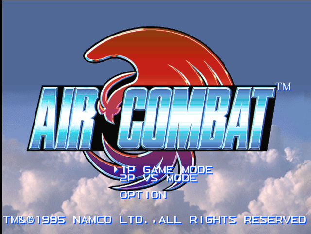
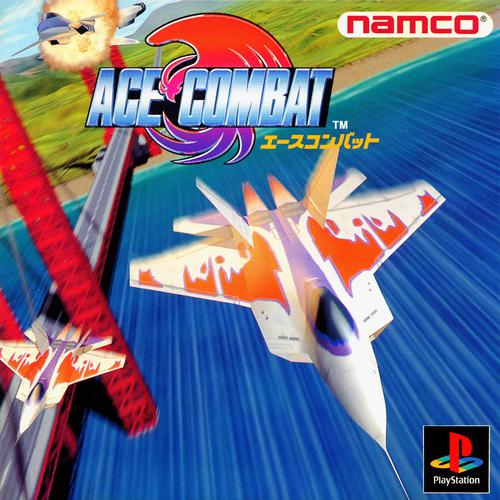
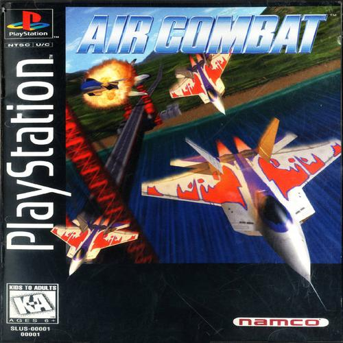
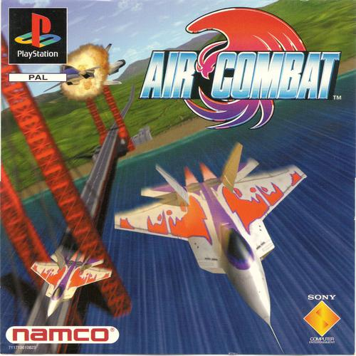

  

This is a strategy guide wiki for Namco's Air Combat/Ace Combat. 

<table>
  <tr>
    <th>Platform</th>
    <th colspan="3">Sony Playstation</th>
  </tr>
  <tr>
    <td>Release Date</td>
    <td>Japan: July 30th, 1995 August 6th, 1996 (Playstation the Best)</td>
    <td>USA: September 9th, 1995</td>
    <td>Europe: February 18th, 2000</td>
  </tr>
  <tr>
    <td>Serial Number</td>
    <td>Japan: SLPS-00061 SLPS-91005 (Playstation the Best)</td>
    <td>USA: SLUS-00001</td>
    <td>Europe: SCES-00007</td>
  </tr>
  <tr>
    <td>Publisher</td>
    <td colspan="3">Namco</td>
  </tr>
  <tr>
    <td>Developer</td>
    <td colspan="3">Namco Hometek</td>
  </tr>
  <tr>
    <td>Box Art</td>
    <td class ="tableImage"></td>
    <td class ="tableImage"></td>
    <td class ="tableImage"></td>
  </tr>
</table>

