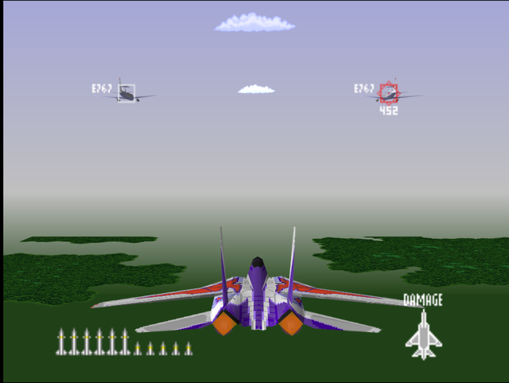
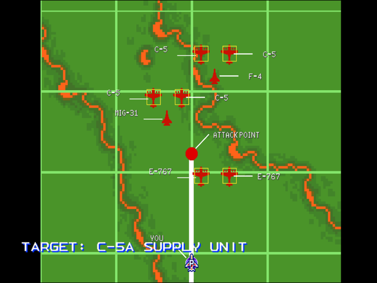

  

# Briefing
This is an evaluation of your operational abilities. Intelligence reports an enemy supply unit moving to resupply their forward positions. You should have the advantage of surprise. We should have localized air superiority for the duration of the operation. Target: C-5A Supply Unit. Good luck.

# Mission Map

  

# Enemy List

|Name|Type|Quantity|Skill|Score|
|-|-|-|-|-|
|C-5A|Target - Air|4|-|70,000|
|E-767|Target - Air|2|-|300,000|
|[F-4](/aircraft/01_f-4)|Enemy - Air|1 (Easy/Normal) 2 (Hard)|Rookie (Easy/Normal) Ace (Hard)|10,000|
|[MiG-31](/aircraft/11_mig-31)|Enemy - Air|1 (Easy/Normal) 2 (Hard)|Rookie (Easy/Normal) Ace (Hard)|50,000|

# Unlock Reward
- 5,000,000 Credits
- New Aircraft: [F-117](/aircraft/06_f-117), [MiG-31](/aircraft/11_mig-31) (Normal/Hard)
- New Wingmen: William ([F-4](/aircraft/01_f-4)), Baron ([F-117](/aircraft/026_f-117)) (Normal/Hard)

# Mission Guide
Recommended aircraft: F-14 (Easy/Normal), F-4 (Hard)
 
The first mission is essentially a training mission in disguise since enemy fighters are few in number and won't do much, and the targets are slow, unarmed transport planes amd E-767s.

The F-4 takes two missiles to shot down while the MiG-31s and large planes take three missiles.

## HARD DIFFICULTY REMARK
AI aggression hasn't increased yet despite the bump in overall enemy AI skill, but since the player only have access to the F-4, the additional F-4 and MiG-31 may pose more trouble than they look.