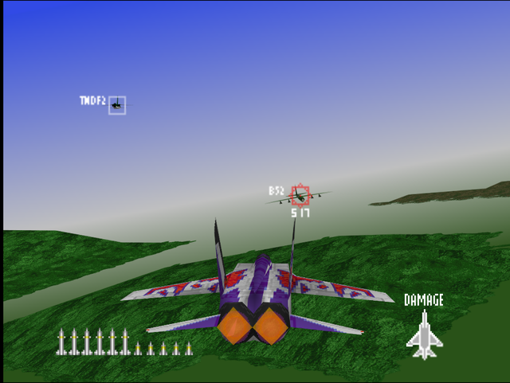
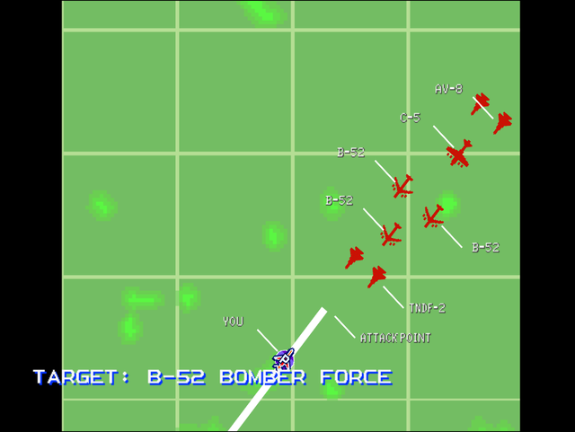

  

# Briefing

Immediate mobilization required. Our base's position was compromised in the last enemy push. Reports indicate imminent arrival of bombers. Scramble and ace those bogeys! Target: B-52 Bomber Force. Good luck.

# Mission Map

  

# Enemy List
|Name|Type|Quantity|Skill|Score|
|-|-|-|-|-|
|B-52|Target - Air|3 (Easy/Normal) 4 (Hard)|-|100,000|
|C-5|Target - Air|1 (Easy/Normal)|-|70,000|
|[TNDF-2](/aircraft/15_tndf-2)|Enemy - Air|2 (Easy/Normal) 4 (Hard)|Rookie (Easy/Normal) Ace (Hard)|30,000|
|AV-8|Enemy - Air|2|Rookie (Easy/Normal) Ace (Hard)|30,000|

# Unlock Reward
- 1,000,000 Credits
- New Aircraft: [TNDF-2](/aircraft/15_tndf-2) (Easy/Normal), [F/A-18](/aircraft/05_fa-18) (Normal/Hard), [F-14](/aircraft/02_f-14) (Hard)
- New Wingman: Yully ([MiG-31](/aircraft/11_mig-31)) (Easy), Baron ([F-117](/aircraft/026_f-117)) (Easy), Philip ([TNDF-2](/aircraft/15_tndf-2)) (Normal/Hard), Sergeo ([F-14](/aircraft/02_f-14)) (Normal/Hard)
- 
# Mission Guide
Recommended aircraft: F-14 or MiG-31

The first actual bomber interception in the game. In fact, the mission will end in failure if any of the bomber managed to reach allied base.

Try to shoot down the B-52s from distance or attack them head on as they're armed with tail guns. The Harriers may prove some trouble as they're very maneuverable for early game enemies. The C-5 can be spared for the last to give opportunity to clean the map of non-target enemies.

## HARD DIFFICULTY REMARK
The lone C-5 gets replaced by another B-52, which means no more way to stall time by sparing one while mopping up the map from non-target bandits.