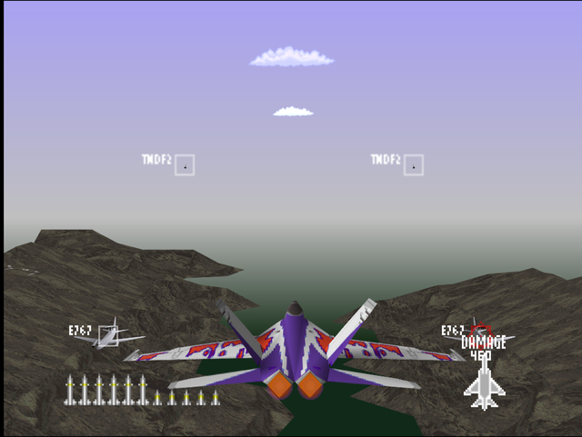
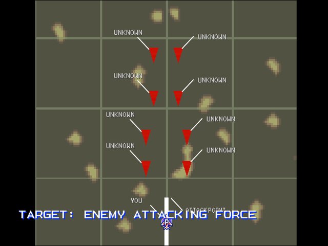

  

# Briefing

AWACS reports and enemy incursion in our sector. We are diverting you from local air support to forward operations. Neutralize the approaching units. Target: Enemy Attacking Force. Formation makeup is unknown. Expect enemy fighter support and a tough dogfight. Good luck.

# Mission Map

  

# Enemy List
|Name|Type|Quantity|Skill|Score|
|-|-|-|-|-|
|E-767|Target - Air|2 (Easy/Normal)|-|300,000|
|[TNDF-2](/aircraft/15_tndf-2)|Target - Air|2|Rookie (Easy/Normal) Ace (Hard)|30,000|
|[F/A-18](/aircraft/05_fa-18)|Target - Air|2 (Easy/Normal) 4 (Hard)|Rookie (Easy/Normal) Ace (Hard)|30,000|
|AV-8|Target - Air|2|Rookie (Easy/Normal) Ace (Hard)|30,000|

# Unlock Reward
- 2,000,000 Credits
- New Aircraft: [F-15](/aircraft/03_f-15) (Easy/Normal), [TNDF-2](/aircraft/15_tndf-2) (Hard)
- New Wingmen: Philip ([TNDF-2](/aircraft/15_tndf-2)) (Easy), Sergeo ([F-14](/aircraft/02_f-14)) (Easy), Yully ([MiG-31](/aircraft/11_mig-31)) (Normal/Hard)

# Mission Guide
Recommended aircraft: F/A-18, MiG-31 or F-14

A pure dogfight mission. The E-767 and Tornados appear first before the player while the slower, more maneuverable Harrier and F/A-18s are trailing from behind.

## HARD DIFFICULTY REMARK
The E-767s at the beginning gets replaced by pair of F/A-18s, which effictively turns the mission into 8 vs 1 dogfight. Head-on attack is much riskier to perform due to more aggressive AI and deadlier enemy weapons.