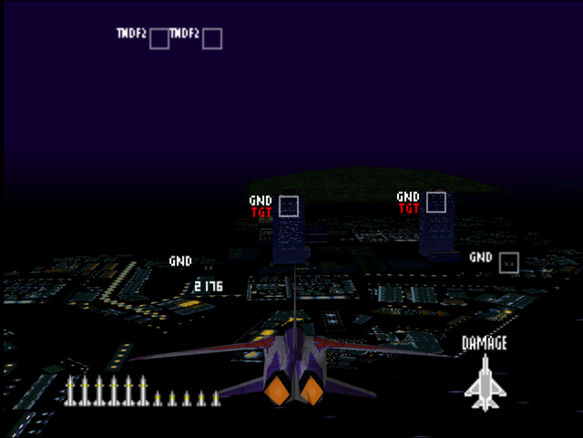
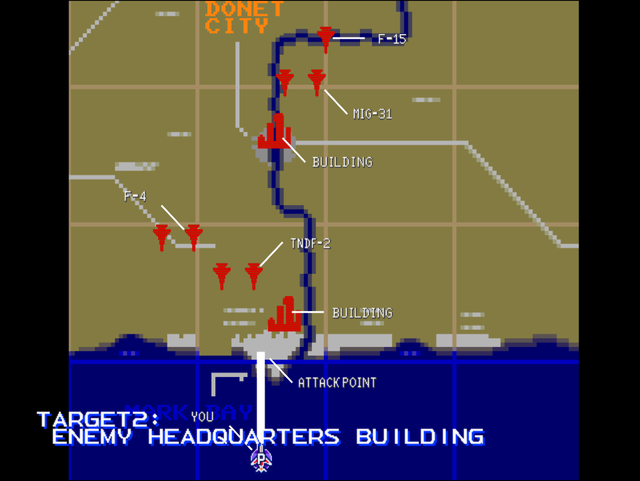

  

# Briefing

Up until now, our offensive missions have been constrained by the presence of civilians in Donet City. A recent evacuation of that city permits us to engage hard targets within the city perimeter. Target 1: Computer communications center. Target 2: Enemy Headquarters building. Night conditions should neutralize enemy ground fire. However, the city has at least three interceptors available. We have no intelligence on force composition. From now on you will have a wingman assigned to you. Inform him of the operation before departure. Good luck!

# Mission Map

  

# Enemy List
|Name|Type|Quantity|Skill|Score|
|-|-|-|-|-|
|Building (GND TGT)|Target - Ground|4|-|800,000|
|AA Gun (GND)|Enemy - Ground|8|-|800,000|
|SAM (GND)|Enemy - Ground|1|-|800,000|
|[F-4](/aircraft/01_f-4)|Enemy - Air|2|Rookie (Easy/Normal) Ace (Hard)|10,000|
|[TNDF-2](/aircraft/15_tndf-2)|Enemy - Air|2|Rookie (Easy/Normal) Ace (Hard)|30,000|
|[MiG-31](/aircraft/11_mig-31)|Enemy - Air|2|Rookie (Easy/Normal) Ace (Hard)|50,000|
|[F-15](/aircraft/03_f-15)|Enemy - Air|1 (Easy/Normal) 2 (Hard)|Rookie (Easy/Normal) Ace (Hard)|40,000|
|RAH-66|Enemy - Air|4 (Hard)|-|10,000|

# Unlock Reward
- 7,000,000 Credits
- Permanent 20% increased mission completion reward
- New Aircraft: [A-10](/aircraft/16_a-10) (Easy), [F-4](/aircraft/01_f-4) (Easy/Normal), [F-15](/aircraft/03_f-15) (Hard)
- New Wingmen: Riho ([F/A-18](/aircraft/05_fa-18)), Timothy ([MiG-29](/aircraft/10_mig-29)) (Easy)

# Mission Guide
Recommended aircraft: F/A-18 or TNDF-2

Night time ground attack mission. The targets are defended with handful of AA guns around the city while the only air threat to worry about is the F-15. Try to approach the target from the west or the east as AA defenses aren't as concentrated at that direction.

For the first time, the player is allowed to hire a wingman. Their simplistic AI won't let them do much but they can serve well at drawing enemy fire.

## HARD DIFFICULTY REMARK
Additional attack helicopters are present near the target buildings. Prioritize them first as they're very aggressive at lobbing missile at player. The F-15 now comes in pairs as well.