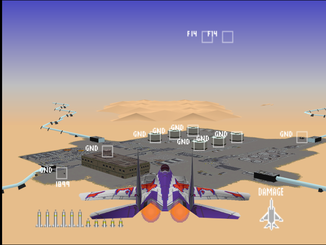
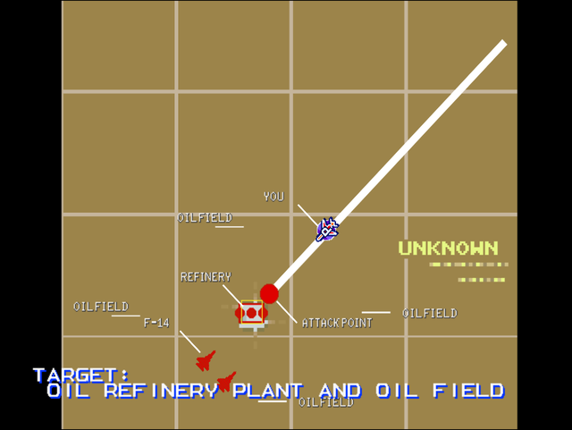
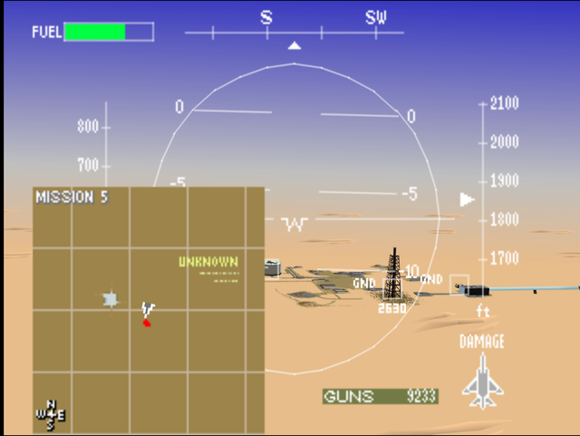
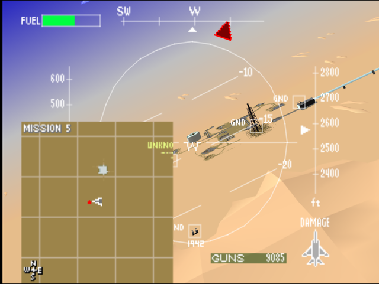
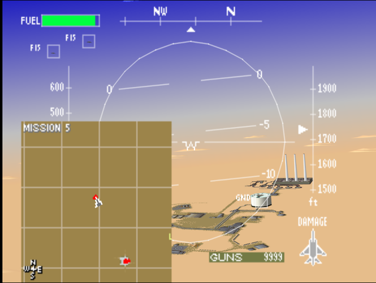

  

# Briefing

Reconnaissance indicates a weak link in their fuel supply infrastructure. A single pipeline transfers all crude oil from their fields to their refinery. Strike both the pipeline and the refinery. Target: Oil refinery plant and oil field. Use the pipeline as a reference to the refinery. Locate and destroy. Good luck!

# Mission Map

  

# Enemy List
|Name|Type|Quantity|Skill|Score|
|-|-|-|-|-|
|Building (GND TGT)|Target - Ground|13|-|800,000|
|AA Gun (GND)|Enemy - Ground|5 (Easy/Normal) 7 (Hard)|-|800,000|
|SAM (GND)|Enemy - Ground|2 (Easy/Normal) 10 (Hard)|-|800,000|
|[F-4](/aircraft/01_f-4)|Enemy - Air|2|Rookie (Easy/Normal) Ace (Hard)|10,000|
|[TNDF-2](/aircraft/15_tndf-2)|Enemy - Air|2|Rookie (Easy/Normal) Ace (Hard)|30,000|
|[F-14](/aircraft/02_f-14)|Enemy - Air|2|Veteran (Easy/Normal) Ace (Hard)|40,000|
|[F-15](/aircraft/03_f-15)|Enemy - Air|2 (Easy/Normal) 4 (Hard)|Veteran (Easy/Normal) Ace (Hard)|40,000|
|AV-8|Enemy - Air|4 (Hard)|-|30,000|

# Unlock Reward
- 10,000,000 Credits
- Permanent 10% discount for aircraft purchase
- New Aircraft: [F-16](/aircraft/04_f-16) (Easy), [YF-23](/aircraft/08_yf-23) (Easy), [A-10](/aircraft/16_a-10) (Normal), [MiG-29](/aircraft/10_mig-29) (Hard)
- New Wingmen: Joe ([F-15](/aircraft/03_f-15)) (Easy), Bill ([F-16](/aircraft/04_f-16)) (Easy), Timothy ([MiG-29](/aircraft/10_mig-29))

# Mission Guide
Recommended aircraft: F/A-18 or F-15

The player starts close to the central refinery area while the remaining targets are hidden on radar until the player approach their location. From the central refinery four pipes are stretching towards each direction, but only the east, south and western pipes that leads to oil field targets.

Prioritize destroying the AA and SAMs with missiles, then oil tanks using guns to conserve ammunition. Enemy air power are scattered apart of each other, but this is the first mission where higher rank enemies started to appear.

For reference, the following screenshots shows the exact locations of the three oil fields hidden on map:

## HARD DIFFICULTY REMARK
Many additional AA and SAMs are placed all over the pipelines and around the oil fields. A couple of Harriers and additional F-15s are also patrolling around the hidden target areas.