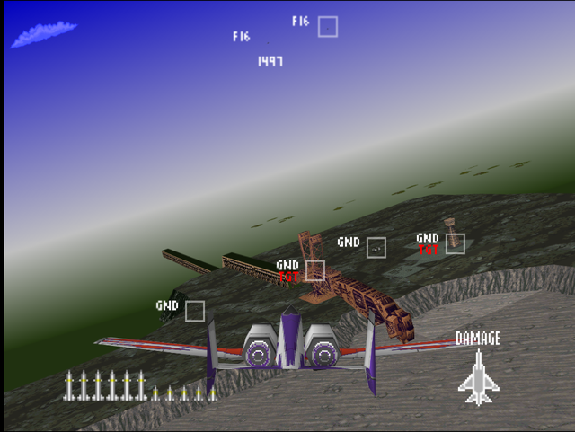
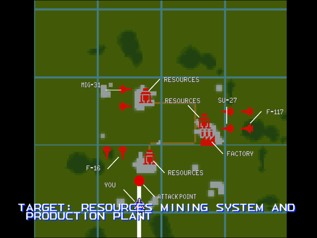

  

# Briefing

The enemy has proved to have significant resources. This war of attrition is not to our advantage. We are now targeting key infrastructure sites. Target: Resources mining system and production plant. Intelligence reports stealth fighters operating in this theater. Remember, their lack of radar signature makes visual sighting essential. Good luck!

# Mission Map

  

# Enemy List
|Name|Type|Quantity|Skill|Score|
|-|-|-|-|-|
|Building (GND TGT)|Target - Ground|4|-|800,000|
|AA Gun (GND)|Enemy - Ground|8 (Easy/Normal)  4 (Hard)|-|800,000|
|SAM (GND)|Enemy - Ground|4 (Easy/Normal)  8 (Hard)|-|800,000|
|[F-117](/aircraft/06_f-117)|Enemy - Air|2|Rookie (Easy/Normal) Ace (Hard)|10,000|
|[Su-27](/aircraft/09_su-27)|Enemy - Air|2|Ace|40,000|
|[MiG-31](/aircraft/11_mig-31)|Enemy - Air|2|Veteran (Easy/Normal) Ace (Hard)|50,000|
|[F-16](/aircraft/04_f-16)|Enemy - Air|2|Rookie (Easy/Normal) Ace (Hard)|40,000|

# Unlock Reward
- 7,000,000 Credits
- New Aircraft: [MiG-29](/aircraft/10_mig-29) (Normal/Hard), [F-16](/aircraft/04_f-16) (if this mission is completed first before [Destroy Pipe-Lines!](/missions/m05-destroy-pipe-lines) on Easy), [YF-23](/aircraft/08_yf-23) (if this mission is completed first before [Destroy Pipe-Lines!](/missions/m05-destroy-pipe-lines) on Easy), [A-10](/aircraft/16_a-10) (Hard)
- New Wingmen: Sally ([A-10](/aircraft/16_a-10))

# Mission Guide
Recommended aircraft: A-10, TNDF-2 or F-15

Another ground strike mission with plenty of enemy air cover. This is the first mission where stealth fighters are present, they're invisible to radar until the player gets close to them. The Su-27s may pose considerable threat as they're very maneuverable and poses the highest enemy AI skill level on Easy or Normal difficulty.

## HARD DIFFICULTY REMARK
Half of the AA guns are replaced with SAMs, which makes approaching mining sites even more difficult. Clear the area of SAMs first before bombing the targets.