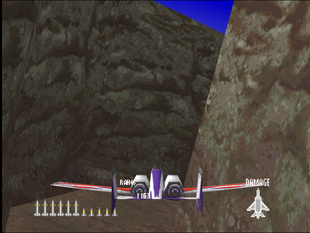
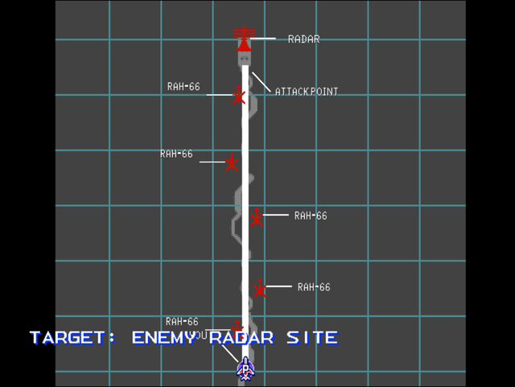

  

# Briefing

The enemy's ADCRS, Air Defense Command and Radar System, has been identified. We can expect a steep drop in enemy effectiveness if this site is destroyed. The enemy has an effective SAM kill zone around the target. Its one weak point is a narrow ravine leading to the base. This requires precision, nap of the earth flying. Target: Enemy radar site. You have no effective countermeasures to this model of SAM (Surface-To-Air Missile). Exit the ravine and you are toast. Good luck!

# Mission Map

  

# Enemy List
|Name|Type|Quantity|Skill|Score|
|-|-|-|-|-|
|Radar (GND TGT)|Target - Ground|1|-|800,000|
|AA Gun (GND)|Enemy - Ground|3 (Hard)|-|800,000|
|RAH-66|Enemy - Air|5|-|50,000|

# Unlock Reward
- 10,000,000 Credits

# Mission Guide
Recommended aircraft: A-10 or F/A-18

The first ravine flight mission in Ace Combat franchise, it's very straightforward and simplistic compared to what to come later. There are very few enemies, but the ravine itself is still nevertheless tricky to navigate due to primitive flight model and inability to increase or decrease throttle.

## HARD DIFFICULTY REMARK
Three AA Guns are added on the way through the ravine. Since the player always flies slowly throughout the mission, try to snipe them with missiles before they start firing.