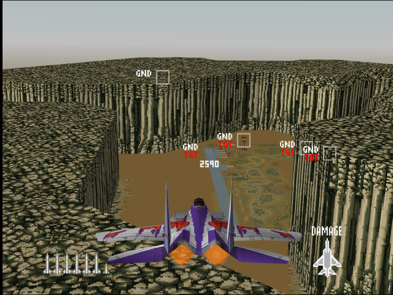
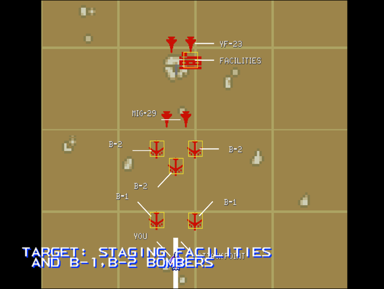

  

# Briefing

"Regaining Donet City is a prime strategic consideration for the enemy. To forestall offensive operations we will strike their staging area. Target: Staging facilities and B-1 bombers. Our goal is to hit them before their incursion begins. Good luck!"

# Mission Map

  

# Enemy List
|Name|Type|Quantity|Skill|Score|
|-|-|-|-|-|
|Building (GND TGT)|Target - Ground|1|-|800,000|
|B-1 (Parked/GND TGT)|Target - Ground|3|-|800,000|
|B-1|Target - Air|2|-|300,000|
|B-2|Target - Air|3|-|800,000|
|AA Guns (GND)|Enemy - Ground|2 (Easy/Normal) 4 (Hard)|-|800,000|
|SAM (GND)|Enemy - Ground|1 (Hard)|-|800,000|
|[MiG-29](/aircraft/10_mig-29)|Enemy - Air|2|Veteran (Easy/Normal) Ace (Hard)|20,000|
|[YF-23](/aircraft/08_yf-23)|Enemy - Air|3|Rookie (Easy/Normal) Ace (Hard)|100,000|

# Unlock Reward
- 12,000,000 Credits
- New Aircraft: [R-C01](/aircraft/r-c01) (Easy), [F-16](/aircraft/04_f-16) (Normal/Hard), [Su-27](/aircraft/09_su-27) (Easy)
- New Wingman: Martin ([YF-23](/aircraft/08_yf-23)) (Easy)

# Mission Guide
Recommended aircraft: F-15, F/A-18 or MiG-29

Start by shooting down the B-1 and B-2 bombers that approaches from the opposite direction. After all bombers and its optional escorts are down, the other targets lies within an airfield concealed around tall ridges. There are some AAs and stealth fighters guarding the airbase so punch through one of the AA position to get into good angle to hit all targets around the airfield before the YF-23s can retaliate. The YF-23 can be nuisance to fight since they can dogfight better than the F-117 from the previous mission while retaining stealth ability.

## HARD DIFFICULTY REMARK
Additional AA Guns and a SAM are placed on the ridge, clear the ridge of AA defenses first before hitting the airfield.