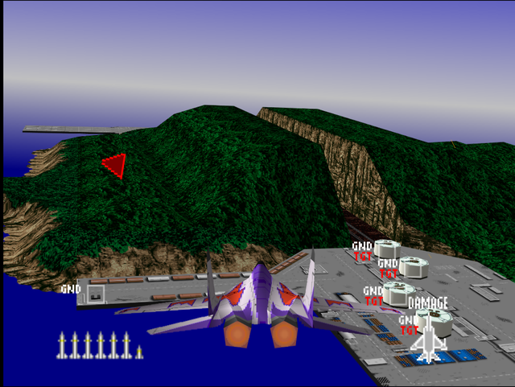
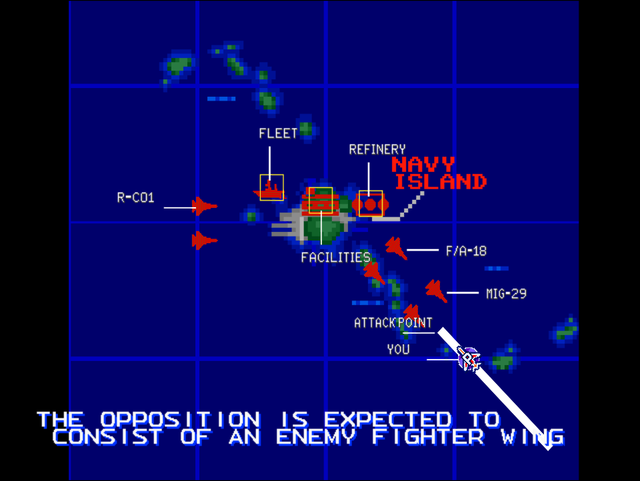

  

# Briefing

"Naval Intelligence report a transport heading to Nouikott Bay. Since it may be a troop transport, we need to sink it before it docks. Follow up with destruction of the island port facilities. The opposition is expected to consist of an enemy fighter wing of unknown composition and patrolling Aegis warships. The Aegis missile system is highly effective; eliminate the warships quickly. Good luck!"

# Mission Map

  

# Enemy List
|Name|Type|Quantity|Skill|Score|
|-|-|-|-|-|
|Destroyer (GND TGT)|Target - Sea|1 (1x AA Gun, 1x SAM, 1x Bridge)|-|800,000|
|Buildings (GND TGT)|Target - Ground|6|-|800,000|
|B-2A (Parked/GND TGT)|Target - Ground|1|-|800,000|
|AA Guns (GND)|Enemy - Ground|3 (Easy/Normal)|-|800,000|
|SAM (GND)|Enemy - Ground|3 (Hard)|-|800,000|
|[MiG-29](/aircraft/10_mig-29)|Enemy - Air|2|Veteran (Easy/Normal) Ace (Hard)|20,000|
|[F/A-18](/aircraft/05_fa-18)|Enemy - Air|2|Rookie (Easy/Normal) Ace (Hard)|30,000|
|[R-C01](/aircraft/13_r-c01)|Enemy - Air|2|Rookie (Easy/Normal) Ace (Hard)|30,000|

# Unlock Reward
- 8,400,000 Credits
- Permanent 10% discount for aircraft purchase
- New Aircraft: [SF-39](/aircraft/12_sf-39) (Easy), [EF-2000](/aircraft/14_ef-2000) (Easy), [YF-23](/aircraft/08_yf-23) (Normal), [F-16](/aircraft/04_f-16) (Hard)
- New Wingmen: Yang ([Su-27](/aircraft/09_su-27)) (Easy), Ana ([R-C01](/aircraft/13_r-c01)) (Easy), Joe ([F-15](/aircraft/03_f-15)) (Normal/Hard), Bill ([F-16](/aircraft/04_f-16)) (Normal/Hard)
 
# Mission Guide
Recommended aircraft: F-15, F/A-18 or MiG-29

The targets are located at the west and east side of the island. The east harbor is guarded by 3 AA guns (or SAMs on Hard mode) while the west harbor has Aegis destroyer as primary target. To completely sink the destroyer, the player must destroy all its 3 components (AA gun, SAM and bridge).

## HARD DIFFICULTY REMARK
AA Guns at the eastern harbor are replaced with SAMs.