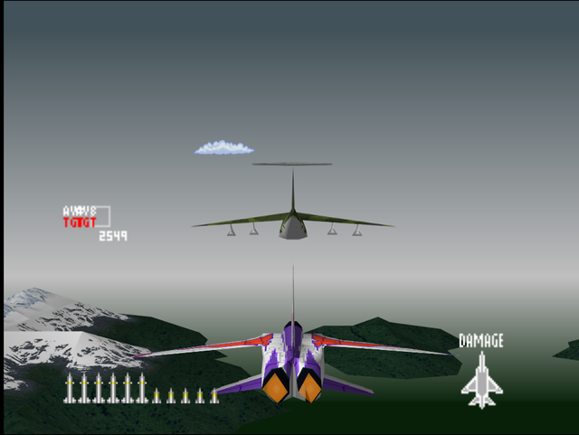
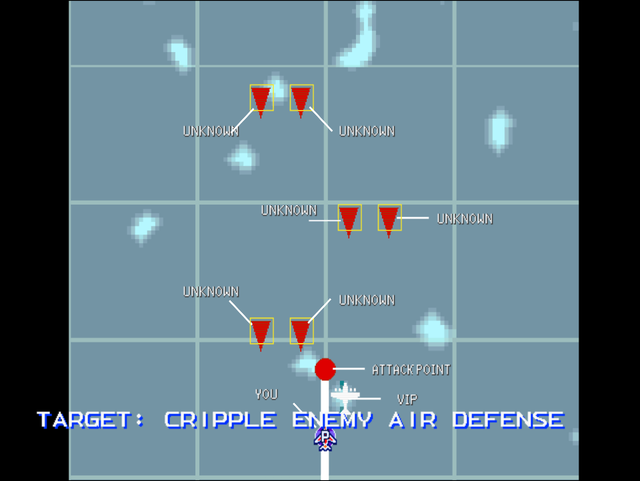

  

# Briefing

"Your mercenary unit has proven its reliability. We request you aid in the extraction of one of our officers from an enemy mountain fortress. We can only send one unit without alerting the opposition. Target: Cripple enemy air defense and land on their runway. Only you have the required skills. You will be paid handsomely. Good luck!"

# Mission Map

  

# Enemy List
|Name|Type|Quantity|Skill|Score|
|-|-|-|-|-|
|C-5|Target - Allied|1|-|-|
|Building (GND)|Enemy - Ground|1|-|800,000|
|[F-15](/aircraft/03_f-15)|Enemy - Air|2 (Easy/Normal) 4 (Hard)|Veteran (Easy/Normal) Ace (Hard)|20,000|
|[F-14](/aircraft/02_f-14)|Enemy - Air|2|Rookie (Easy/Normal) Ace (Hard)|30,000|
|AV-8|Enemy - Air|2|Rookie (Easy/Normal) Ace (Hard)|60,000|

# Unlock Reward
- 12,000,000 Credits
- New Aircraft: [Su-27](/aircraft/09_su-27) (Easy/Normal), [R-C01](/aircraft/13_r-c01) (Normal/Hard)
- New Wingman: Juliette ([EF-2000](/aircraft/14_ef-2000)) (Normal/Hard)
# Mission Guide
Recommended aircraft: F-15, F-16, or YF-23

The only escort mission in the game. The player is tasked to escort an C-5 from waves of enemy fighters that appears from the north. Thankfully it's easier than it sounds as enemy squadrons are placed far apart of each other so there's plenty of room for breather in between waves.

The briefing mentions enemy air defense and runway, but actually only the control tower that can be found and taken out in this mission, it's located at the opposite direction from the starting point.

## HARD DIFFICULTY REMARK
Two extra F-15s join the fray early which makes the first enemy wave much more frantic. Aggro them as quickly as possible to prevent them to focus fire on the transport.