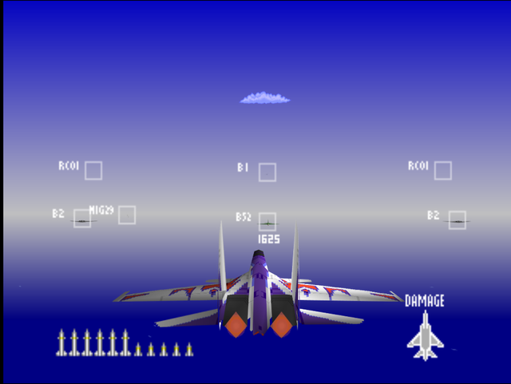
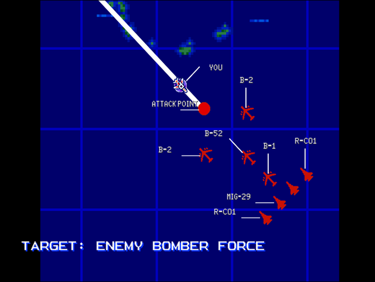

  

# Briefing

"The captured port has become a key resupply facility for our forces. We cannot allow the enemy to cripple or recapture it. Current Intel suggests the enemy is preparing a bombing raid utilizing stealth bombers. Even one can devastate the facility. Keep alert! Target: Stealth bomber wing. Good luck!"

# Mission Map

  

# Enemy List
|Name|Type|Quantity|Skill|Score|
|-|-|-|-|-|
|B-52|Target - Air|2|-|100,000|
|B-1|Target - Air|1|-|150,000|
|B-2|Target - Air|1|-|300,000|
|[MiG-29](/aircraft/10_mig-29)|Enemy - Air|2|Rookie (Easy/Normal) Ace (Hard)|40,000|
|[R-C01](/aircraft/13_r-c01)|Enemy - Air|2 (Easy/Normal) 4 (Hard)|Rookie (Easy/Normal) Ace (Hard)|60,000|

# Unlock Reward
- 12,000,000 Credits
- New Aircraft: [R-C01](/aircraft/13_r-c01) (if this mission is completed first before [Destroy Enemy Staging Zone](/missions/m08-destroy-enemy-staging-zone) on Easy or [VIP Recovery Mission!](/missions/m10-vip-recovery-mission) on Normal), [Su-27](/aircraft/09_su-27) (if this mission is completed first before [VIP Recovery Mission!](/missions/m10-vip-recovery-mission) on Easy/Normal), [YF-23](/aircraft/08_yf-23) (Hard)
- New Wingman: Martin ([YF-23](/aircraft/08_yf-23)) (Normal/Hard)
# Mission Guide
Recommended aircraft: Su-27

A bomber intercept mission much like [Fighter Superiority!](/missions/m02-fighter-superiority) found in early game. Same failure condition and strategy applies, but watch out for more maneuverable escort fighters.

## HARD DIFFICULTY REMARK
Two additional R-C01s are added into the escort wing.