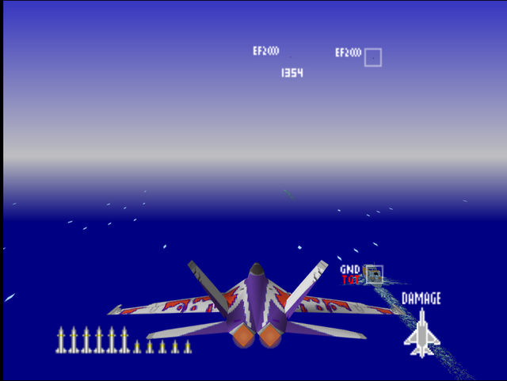
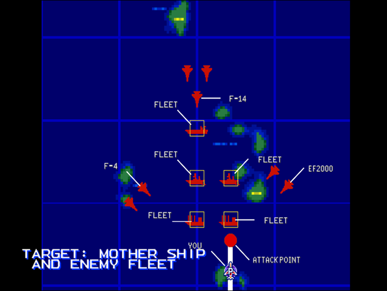

  

# Briefing

"The enemy is committing its huge mother ship to this theater. They are growing desperate. Eliminate the mother ship and their naval mobility is crippled. There are no reference points on the ocean. Pay attention to the operational map. Target: Mother ship. Good luck!"

# Mission Map

  

# Enemy List
|Name|Type|Quantity|Skill|Score|
|-|-|-|-|-|
|Transport (GND TGT)|Target - Sea|2 (1x AA Guns, 1x Bridge on Hard)|-|800,000|
|Carrier (GND TGT)|Target - Sea|1 (2x AA Guns on Easy/Normal or 4x AA Guns on Hard, 1x Bridge)|-|800,000|
|Destroyer (GND TGT)|Target - Sea|2 (1x AA Gun, 1x SAM, 1x Bridge)|-|800,000|
|[F-4](/aircraft/01_f-4)|Enemy - Air|2|Veteran (Easy/Normal) Ace (Hard)|10,000|
|[F-14](/aircraft/02_f-14)|Enemy - Air|3|Veteran (Easy/Normal) Ace (Hard)|40,000|
|[EF-2000](/aircraft/14_ef-2000)|Enemy - Air|2|Rookie (Easy/Normal) Ace (Hard)|20,000|

# Unlock Reward
- 13,300,000 Credits
- New Aircraft: [SF-39](/aircraft/12_sf-39) (Easy/Normal), [EF-2000](/aircraft/14_ef-2000) (if this mission is completed first before [Destroy Military Port Facilities](/missions/m09-destroy-military-port-facilities on Easy)), [Su-27](/aircraft/09_su-27) (Hard)
- New Wingman: Ana ([R-C01](/aircraft/13_r-c01)) (Normal), Yang ([Su-27](/aircraft/09_su-27)) (Normal/Hard)

# Mission Guide
Recommended aircraft: F-15, Su-27

An anti-ship mission consisting of five targets: two lightly armed transport ships, two Aegis destroyers with highly dangerous SAM and an aircraft carrier. Enemy fighters don't pose too much threat outside the EF-2000s, but enemy ships' AA can quickly shred player's plane if not disposed ASAP. Focus on sinking everything but the unarmed transport ships first if one is aiming to clear the area of all enemy fighters.

## HARD DIFFICULTY REMARK
The transport ships are now armed with one AA Guns while aircraft carrier has two extra AA guns. Outranging the ships' AA guns is the key to survive this mission.