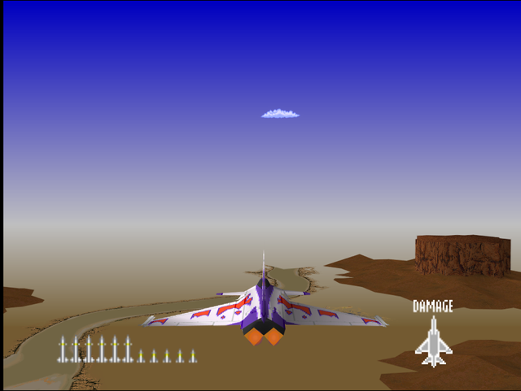
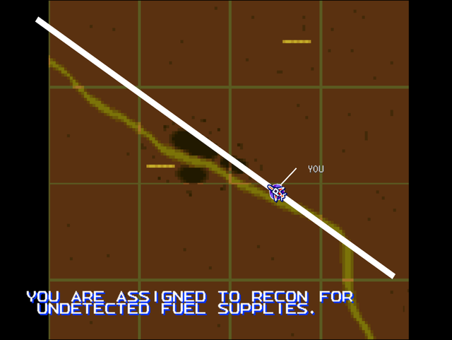

  

# Briefing

"Despite the elimination of all fuel refineries, the enemy continues to conduct operations. You are assigned to recon for undetected fuel supplies. Although this is just recon, engage and eliminate any opposition patrols. Good hunting!"

# Mission Map

  

# Enemy List
|Name|Type|Quantity|Skill|Score|
|-|-|-|-|-|
|RAH-66|Target - Air|4 (Hard)|-|40,000|
|C-5 (Parked/GND TGT)|Target - Ground|1|-|800,000|
|[YF-23](/aircraft/08_yf-23)|Target - Air|2|Rookie (Easy/Normal) Ace (Hard)|200,000|
|[F-15](/aircraft/03_f-15)|Target - Air|2|Veteran (Easy/Normal) Ace (Hard)|80,000|

# Unlock Reward
- 1,400,000 Credits
- New Aircraft: [SF-39](/aircraft/12_sf-39) (Normal if this mission is completed first before [Storm the Mother Ship!](/missions/m12-storm-the-mother-ship)/Hard)
- New Wingman: Ana ([R-C01](/aircraft/13_r-c01)) (Hard)
# Mission Guide
Recommended aircraft: Su-27, R-C01

A short air-to-air mission. The targets are initially hidden from radar until the player approach them, but their location is near the ridges directly ahead of the starting position.

## HARD DIFFICULTY REMARK
Four RAH-66s are guarding the area near target. They start from ground altitude so they can be taken by surprise before they can target the player.