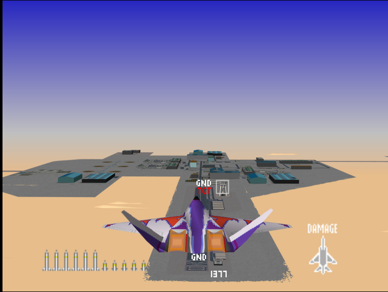
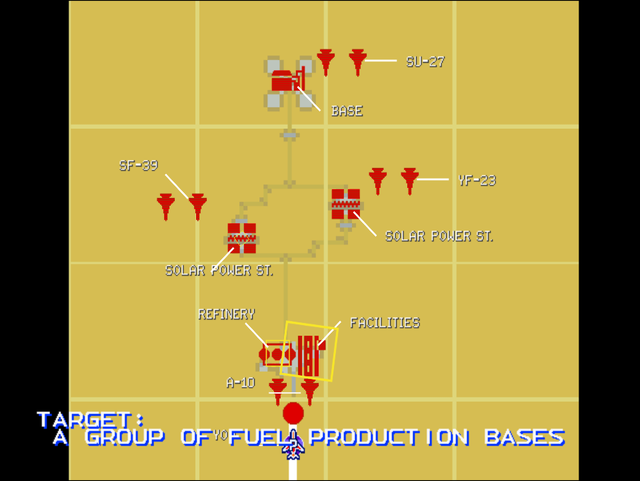

  

# Briefing

"Our recon work has identified the last fuel depot. Go and bomb it flat. Target: A group of fuel production bases. The enemy is using its top guns in this theater. Keep focused and good hunting!"

# Mission Map

  

# Enemy List
|Name|Type|Quantity|Skill|Score|
|-|-|-|-|-|
|Building (GND TGT)|Target - Ground|13|-|800,000|
|AA Guns (GND)|Enemy - Ground|9 (Easy/Normal) 8 (Hard)|-|800,000|
|SAM (GND)|Enemy - Ground|3 (Hard)|-|800,000|
|RAH-66|Enemy - Air|6|-|40,000|
|[YF-23](/aircraft/08_yf-23)|Enemy - Air|2|Rookie (Easy/Normal) Ace (Hard)|200,000|
|[A-10](/aircraft/16_a-10)|Enemy - Air|2|Veteran (Easy/Normal) Ace (Hard)|20,000|
|[SF-39](/aircraft/12_sf-39)|Enemy - Air|2|Veteran (Easy/Normal) Ace (Hard)|80,000|
|[Su-27](/aircraft/09_su-27)|Enemy - Air|2|Ace|80,000|

# Unlock Reward
- 14,000,000 Credits
- Permanent 20% discount for aircraft purchase
- New Aircraft: [EF-2000](/aircraft/14_ef-2000), [F-22](/aircraft/07_f-22) (Hard)
- New Wingman: Fritz ([SF-39](/aircraft/12_sf-39)) (Easy/Normal), Hal ([F-22](/aircraft/07_f-22)) (Hard)

# Mission Guide
Recommended aircraft: A-10 or F-15

Large scale ground attack mission, the target fuel depots are heavily guarded from both on the ground and in the air. There are at least two AA guns at each base, with the northern base having three AA guns. Bringing a wingman is a must to reduce pressure from enemy fighters. 

## HARD DIFFICULTY REMARK
Three SAMs are placed around the northernmost base replacing most of the AA guns there, one of which is right next to a target building which should be dispatched first.