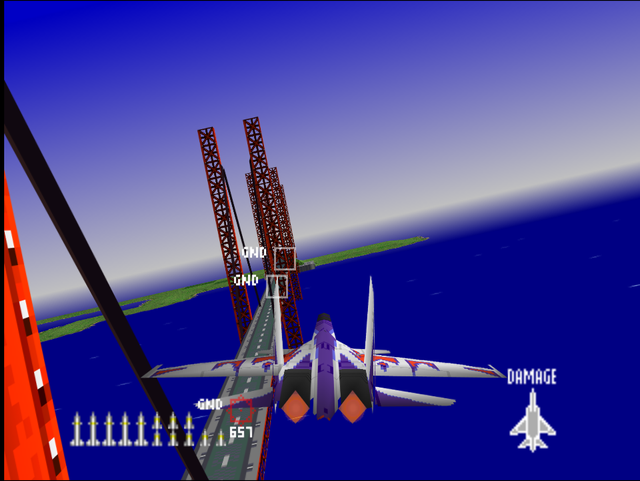
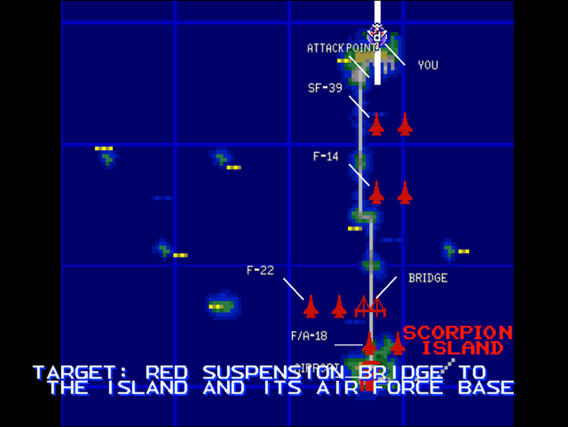

  

# Briefing

"Our offensive operations are now concentrated on the Scorpion Island Fortress. The base itself is a hard nut to crack, but we will isolate it by eliminating it's bridge and central runway. Target: Red suspension bridge to the island, and its air force base. There will be plenty of Ack-Ack and SAM defense around the runway. Go in for one pass, then break off operations. Good luck!"

# Mission Map

  

# Enemy List
|Name|Type|Quantity|Skill|Score|
|-|-|-|-|-|
|Bridge (GND TGT)|Target - Ground|3|-|800,000|
|Building (GND TGT)|Target - Ground|1|-|800,000|
|C-5 (Parked/GND TGT)|Target - Ground|2|-|800,000|
|AA Guns (GND)|Enemy - Ground|8 (Easy/Normal) 4 (Hard)|-|800,000|
|SAM (GND)|Enemy - Ground|3 (Easy/Normal) 6 (Hard)|-|800,000|
|[F-22](/aircraft/07_f-22)|Enemy - Air|2|Veteran (Easy/Normal) Ace (Hard)|100,000|
|[F-14](/aircraft/02_f-14)|Enemy - Air|2 (Easy/Normal( 4 (Hard)|Ace|40,000|
|[SF-39](/aircraft/12_sf-39)|Enemy - Air|2|Ace|40,000|
|[F/A-18](/aircraft/05_fa-18)|Enemy - Air|2|Ace|30,000|

# Unlock Reward
- 28,500,000 Credits
- New Aircraft: [F-22](/aircraft/07_f-22) (Easy/Normal)
- New Wingman: Hal ([F-22](/aircraft/07_f-22)) (Easy/Normal), Fritz ([SF-39](/aircraft/12_sf-39)) (Hard)
  
# Mission Guide
Recommended aircraft: EF-2000 or Su-27

A gauntlet mission where the targets lies at the island to the far south side of the map. There are plenty of strong enemy fighters and anti-air defenses along the highway, while airbase on the island itself is lightly guarded by one AA Gun and an SAM.

## HARD DIFFICULTY REMARK
Almost all of the AA Guns across the highway are replaced with SAMs. Player should either rush through towards the bridge or completely avoid flying near the highway to avoid immediate danger of instantly being shot down by a SAM Two additional F-14s are also placed near the Scorpion Island.