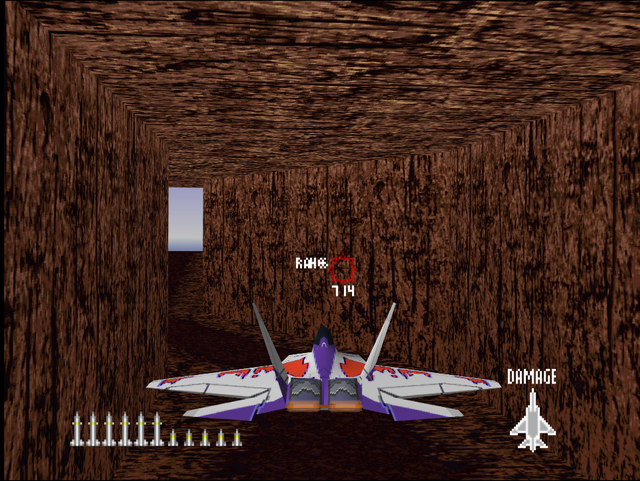
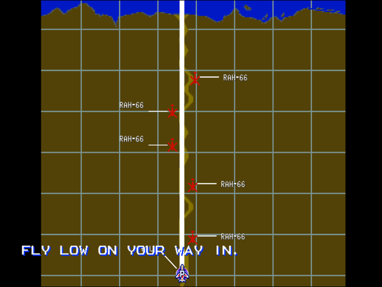

  

# Briefing

The enemy is on his last legs. One more strike should lay him out. Take your unit through the ravine to the enemy headquarters. Intel is sketchy on force composition near the headquarters, so keep on your toes. Fly low on your way in. Everything above the ravine is a SAM kill zone. Good luck.

# Mission Map

  

# Enemy List
|Name|Type|Quantity|Skill|Score|
|-|-|-|-|-|
|AA Gun (GND)|Enemy - Ground|7 (Hard)|-|800,000|
|RAH-66|Enemy - Air|5|-|50,000|

# Unlock Reward
- 10,000,000 Credits

# Mission Guide
Recommended aircraft: A-10 or F-22

Ravine/cavern flight mission with more treacherous terrain compared to the ravine flight on [Supress Enemy Radar Base!](/missions/m07-supress_enemy_radar_base). Enemy presence is minimal so the player can focus more on navigating through the ravine. The mission ends once the player reaches the open area at the end of the cavern.

## HARD DIFFICULTY REMARK
Seven AA Guns are added on the way through the ravine. Some of them are placed in pairs.