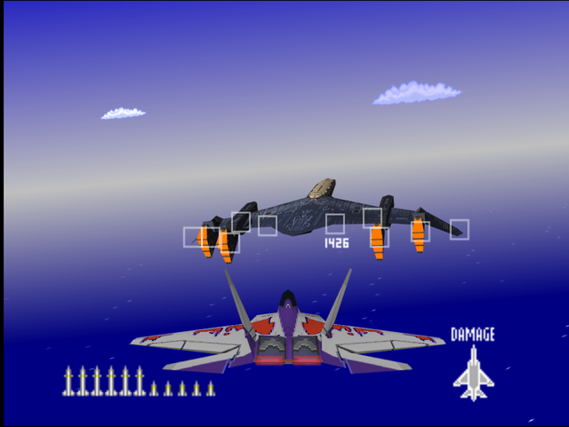
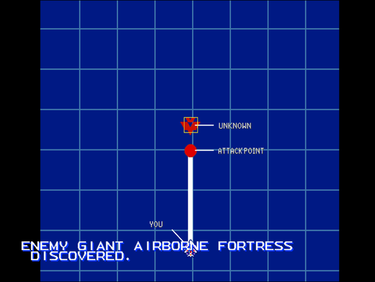

  

# Briefing

"Urgent message! Enemy giant Airborne Fortress discovered. This may be your final task. Eliminate it before it reaches our air space! Good luck!"

# Mission Map

  

# Enemy List
|Name|Type|Quantity|Skill|Score|
|-|-|-|-|-|
|Airship Engines|Target - Air|4|-|-|
|Airship Bridge|Target - Air|1|-|-|
|Airship Missile|Enemy - Air|4 (Respawns indefinitely)|-|-|
|Airship Guns|Enemy - Air|2 (Respawns indefinitely)|-|-|
|[F-22](/aircraft/07_f-22)|Enemy - Air|1 (Respawns indefinitely)|Ace|-|

# Unlock Reward
- All aircraft unlocked from the start (Easy)
- All wingmen unlocked from the start (Normal)
- Mission selection (Hard)

# Mission Guide
Recommended aircraft: Su-27 or F-22

The final mission pits the player against an airborne fortress with an escorting F-22 that respawns indefinitely. The airborne fortress has its four engines as primary weak spot, the hull/bridge itself only can be destroyed after all its four engines are down.

Just like the F-22, airborne fortress' defensive armaments will respawn about 10 seconds after they're destroyed so it's advisable not to waste ammo against them. However destroying the fortress' machine gun turrets before attacking its engine could provide a safer approach since they're more dangerous and accurate than the missile launchers.

## HARD DIFFICULTY REMARK
The airborne fortress and its components are more durable. Each engine pod can take up to 6-8 missiles to bring down depending on plane used so that's about at least 24 missiles required to destroy all the engines. 