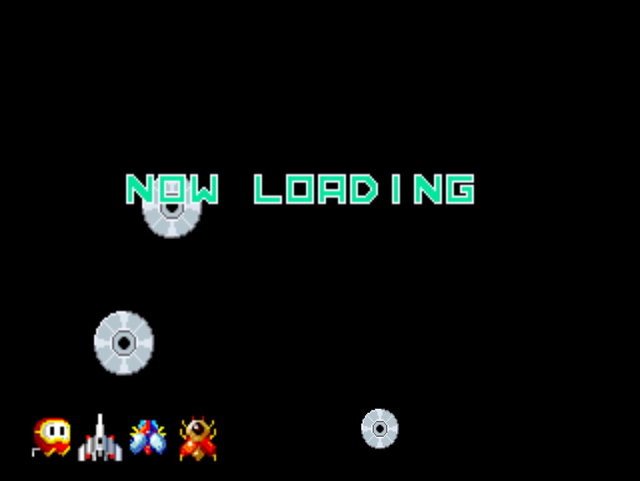
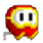
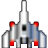
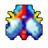
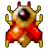
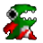
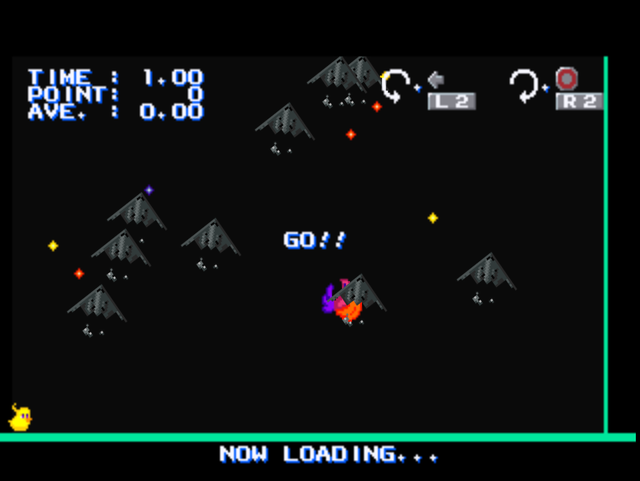

  

## Secret Loading Screen
Hold R1 + Circle before loading screen appears. If it's done correctly, the loading screen will appear in black background with jumping discs instead of the usual Phoenix emblem.
From this loading screen, various command input can be used to access various cheats. Characters from Gaplus or Dig-Dug will appear at the bottom left to indicate the cheat is correctly enabled.

<b>WARNING</b>: These effects are permanently applied to the current active save when saving the game and cannot be reverted

|Cheat Effect|Input|Cheat Icon
|-|-|-|
|999,999,000 Credits|Down, Circle, Triangle, Triangle, Triangle, Circle, Triangle, Circle, Triangle, Circle + Triangle, Circle + Triangle|

|
|Alternate color for wingmen|Start x10, R1|

|
|Alternate color for player|Up, Down, Left, Right, Up, Down, Left, Right, R1|

|
|Selectable Alternate color in 2-Player Mode|Left, Right, Left, Right, Down, Up, Down, Up, Triangle, Triangle, Triangle|

|
|Start Loading Screen Mini-Game|Start x10, R1|

|

## Secret Mini-Game

  

The aim of this mini-game is achieving the highest points-per-second rate by running over incoming planes (either B-2 bombers or UFOs) and missiles with cartoon Phoenix logo. Press L2/Left/Square to turn Phoenix counter-clockwise, and press R2/Right/Circle to turn Phoenix clockwise. Press R1 to change control method between rotation or diagonal movement.

The minigame timer is indicated by little bird that walks from the bottom left to bottom right corner of the screen. The mini-game session ends once the bird reaches right corner of the screen.

If the player managed to hit <b>4.70 points-per-second</b> rate the player will get a congratulations message and rewarded with free aircraft and wingman hiring cost for the remainder of the game. To cancel the mini-game and revert back to secret loading screen, Hold R1 + Circle before loading screen appears.

## Game Completion Rewards
Various secrets can be unlocked after completing the game. Completing the game on harder difficulty will subsequently unlock secrets unlocked on lower difficulty as well.

- Easy: Unlocks all aircraft from the start, the player no longer need to buy each aircraft individually to unlock them. Indicated by <b>EXTRA010</b> (US/PAL)/<b>OMAKE010</b> (JP) at main menu
- Normal: Unlocks all wingmen once the wingmen selection is available after completing mission 4. Indicated by <b>EXTRA110</b> (US/PAL)/<b>OMAKE110</b> (JP) at main menu
- Hard: Unlocks level selection, which lets the player to play any level from the beginning. Indicated by <b>EXTRA111</b> (US/PAL)/<b>OMAKE111</b> (JP) at main menu